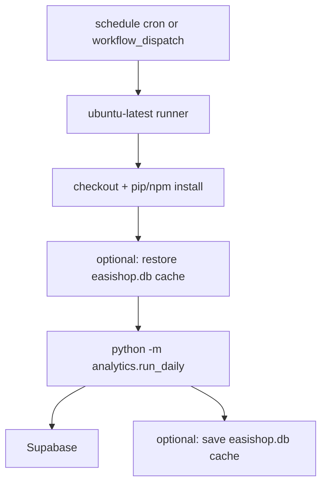

# Session Handover — 2026-06-25 (automation options)

## Project vision (unchanged)

**propo** — RentCast-style property intelligence for Zimbabwe: multi-source listings that compound over time, ingested into Supabase, with automated daily runs.

---

## Workspace

| Item | Value |
|---|---|
| Repo | `https://github.com/tendaikatiyo/propo` |
| Handover folder | `prompts/handovers/` |
| Supabase project | `uscnuatdvjjzudnzsojz` |
| VM (paused for scrape) | `n8npropo` (GCP) — see [2026-06-17 handover](./2026-06-17-vm-supabase-n8n-automation.md) |
| Related same-day handover | [2026-06-25-days-on-market-metrics.md](./2026-06-25-days-on-market-metrics.md) |

---

## What this session covered

**No code or workflow files were merged.** This was a **planning / architecture** session on how to automate the daily pipeline without relying on the GCP VM (blocked for some scrapers) or manual local runs.

Topics discussed:

1. **Cloudflare Workers** — can they run the full scrape + ingest operation?
2. **GitHub Actions** — how scheduling and runners work for propo
3. **Supabase ingest via GitHub Actions** — confirmed end-to-end automation is possible in one job

---

## Current manual routine (interim, from 2026-06-17)

Until automation is wired, the active plan is daily scrape + full Supabase sync from the **local machine** (where classifieds IPs are not blocked):

```powershell
cd C:\Users\Katiyo\Documents\GitHub\propo
.\.venv\Scripts\Activate.ps1
python -m analytics.run_daily
# equivalent: npm run daily
```

That runs `scrape_all` → `run_pipeline_cloud` (SQLite ingest, analytics build, Supabase history + dashboard sync).

---

## Pipeline recap (what automation must run)

```
scrape_all (8 Python scrapers, ~30–45 min)
    → run_pipeline_cloud
        → ingest_all (SQLite: data/easishop.db)
        → build_daily_market_snapshots
        → export_current_json
        → npm run analytics:build
        → ingest_supabase
        → sync_dashboard
    → Supabase (Postgres)
```

**VM/bash equivalent:** `scripts/daily_pipeline.sh` (uses `run_pipeline` instead of `run_pipeline_cloud` — same Supabase outcome, slightly different local SQLite path).

### Which command populates which Supabase tables

| Command | Tables updated |
|---|---|
| `python -m analytics.ingest_supabase` | `listings`, `listing_snapshots`, `market_snapshots_daily`, `ingest_runs` |
| `python -m analytics.sync_dashboard` | `market_metrics`, `cities`, `rankings` |
| `python -m analytics.run_pipeline_cloud` | **All of the above** |
| `python -m analytics.run_daily` | Scrape + **all of the above** |

---

## Decision: Cloudflare Workers

**Verdict: cannot run the pipeline natively. Can only trigger something else.**

| Requirement | propo pipeline | Cloudflare Workers |
|---|---|---|
| Runtime | Python + Node + bash | JavaScript/TypeScript/Wasm only |
| Duration | 30–60+ minutes | Seconds to ~15 min max |
| Subprocesses | `python -m scraper.*`, `npm run …` | Not supported |
| Filesystem | `data/*.json`, `data/easishop.db` | No persistent local disk |
| Scraping | `requests` + BeautifulSoup | Full rewrite required |

**Valid Worker use cases (not implemented):**

- Cron trigger → HTTPS POST to VM webhook or GitHub `workflow_dispatch`
- Telegram alert on failure
- Stale-data health check against Supabase

**Not recommended:** porting scrapers to Workers.

---

## Decision: GitHub Actions

**Verdict: good fit for full automation (scrape + Supabase ingest) if runner IPs are not blocked.**

GitHub Actions spins up an ephemeral `ubuntu-latest` VM on a schedule, runs the same Python/Node commands as local, then destroys the runner.



### Why GitHub Actions fits

- Runs **Python + Node** unchanged — no rewrite
- **90+ minute** job timeout covers the 30–45 min scrape
- **Different egress IP** than GCP VM (Azure) — may unblock classifieds.co.zw (untested)
- **Supabase ingest included** in `run_daily` / `run_pipeline_cloud` — not a separate system
- No VM or n8n to maintain for scheduling

### Caveats

| Topic | Detail |
|---|---|
| **Secrets** | `.env` is not in repo. Add `SUPABASE_URL`, `SUPABASE_SERVICE_ROLE_KEY`, `SUPABASE_DB_URL` as GitHub repository secrets; inject via `env:` in workflow step |
| **SQLite on runner** | `data/easishop.db` is gitignored and wiped each run. Use `actions/cache` for local compounding, or treat Supabase as source of truth |
| **IP blocking** | Run one manual `workflow_dispatch` test before enabling daily cron — classifieds may block GitHub/Azure IPs too |
| **Private repo minutes** | ~45 min/day ≈ 1,350 min/month — tight on GitHub Free (2,000 min); fine on paid or public repos |
| **No workflow yet** | `.github/workflows/` does not exist in repo as of this session |

### Required GitHub secrets

| Secret | Used by |
|---|---|
| `SUPABASE_URL` | `sync_dashboard`, config |
| `SUPABASE_SERVICE_ROLE_KEY` | REST writes (must be **service_role**, not publishable/anon) |
| `SUPABASE_DB_URL` | `ingest_supabase` bulk Postgres (prefer pooler port **6543**) |

Code reads env via `analytics/supabase_config.py`. Workflow-injected env vars work without a `.env` file on the runner.

### Recommended workflow (not yet committed)

File to add: `.github/workflows/daily-pipeline.yml`

```yaml
name: Daily propo pipeline

on:
  schedule:
    - cron: "0 2 * * *"   # 02:00 UTC daily (04:00 CAT)
  workflow_dispatch:

jobs:
  pipeline:
    runs-on: ubuntu-latest
    timeout-minutes: 90

    steps:
      - uses: actions/checkout@v4

      - uses: actions/setup-python@v5
        with:
          python-version: "3.12"

      - uses: actions/setup-node@v4
        with:
          node-version: "20"

      - uses: actions/cache@v4
        with:
          path: data/easishop.db
          key: easishop-db-${{ github.run_number }}
          restore-keys: |
            easishop-db-

      - name: Install dependencies
        run: |
          pip install -r requirements.txt
          npm ci

      - name: Scrape + ingest + Supabase sync
        env:
          SUPABASE_URL: ${{ secrets.SUPABASE_URL }}
          SUPABASE_SERVICE_ROLE_KEY: ${{ secrets.SUPABASE_SERVICE_ROLE_KEY }}
          SUPABASE_DB_URL: ${{ secrets.SUPABASE_DB_URL }}
        run: python -m analytics.run_daily
```

**First test:** use `workflow_dispatch` only (no cron) until scrape + Supabase tables verify.

### Split workflows (optional)

| Goal | Command in workflow |
|---|---|
| Full daily | `python -m analytics.run_daily` |
| Ingest only (no scrape) | `python -m analytics.run_pipeline_cloud` |
| Supabase history only | `python -m analytics.ingest_supabase` |
| Dashboard only | `python -m analytics.sync_dashboard` |

Useful if scraping stays local but Supabase push moves to CI, or for re-running ingest after credential fixes.

---

## Scheduler comparison (updated)

| Approach | Runs full pipeline | Scrape IP | Maintains server | Status |
|---|---|---|---|---|
| Manual local | Yes | Home (works) | No | **Active interim** |
| cron on GCP VM | Yes | GCP (403 on classifieds) | Yes | Paused |
| n8n on GCP VM | Yes | GCP | Yes | Paused |
| Cloudflare Worker (native) | No | Edge | No | Not viable |
| Cloudflare Worker → webhook | Triggers only | Depends on target | Minimal | Not implemented |
| **GitHub Actions** | **Yes** | **Azure (untested)** | **No** | **Recommended next step** |

---

## Next steps (for a future session)

1. **Add** `.github/workflows/daily-pipeline.yml` (template above).
2. **Add secrets** in GitHub repo settings (copy from local `.env`).
3. **Manual test** via Actions → Run workflow → confirm:
   - Scrapers complete (watch for 403 on classifieds)
   - Supabase `ingest_runs` has today's row
   - `listings`, `listing_snapshots`, `market_metrics` updated
4. **Enable cron** after successful manual run.
5. **Optional:** Telegram failure notification step (pattern in [2026-06-17 handover](./2026-06-17-vm-supabase-n8n-automation.md)).
6. **Optional:** If GitHub IP is blocked, fall back to local scrape + GHA ingest-only job (`run_pipeline_cloud` with pre-uploaded artifacts — more complex).

---

## Verify after first automated run

**Supabase Table Editor:**

- `ingest_runs` — latest row with today's timestamp
- `listings` — ~14k active rows
- `listing_snapshots` — grows each run
- `market_snapshots_daily` — suburb aggregates for today
- `market_metrics`, `cities`, `rankings` — dashboard tables

**Local (if caching SQLite):**

```powershell
python -c "import sqlite3; c=sqlite3.connect('data/easishop.db'); print('active:', c.execute('select count(*) from listings where is_active=1').fetchone()[0])"
```

---

## Files referenced (unchanged this session)

| Path | Role |
|---|---|
| `analytics/run_daily.py` | Scrape + `run_pipeline_cloud` |
| `analytics/run_pipeline_cloud.py` | SQLite + analytics + Supabase |
| `analytics/ingest_supabase.py` | Bulk history → Postgres |
| `analytics/sync_dashboard.py` | JSON metrics → Supabase REST |
| `analytics/supabase_config.py` | Env var loading |
| `scripts/daily_pipeline.sh` | VM/cron bash wrapper |
| `scripts/n8n-workflow.md` | n8n setup guide |

---

## One-line summary

**GitHub Actions can automate the entire daily flow including Supabase ingest in one scheduled job; Cloudflare Workers cannot run the pipeline themselves — only trigger it. Next step is add the workflow file, set three Supabase secrets, and test with `workflow_dispatch`.**
