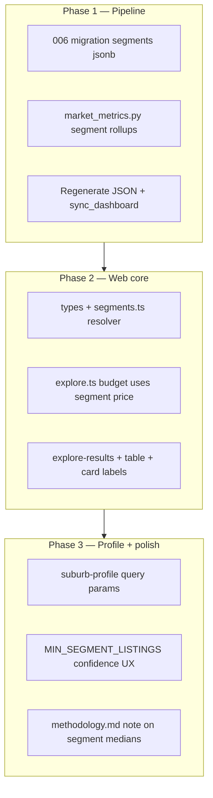

# Session Handover — 2026-06-26 (segment medians — Option B)

## Goal

When a user filters by **property type** and/or **bedrooms** (e.g. 1-bed house in Borrowdale), the app should show **median rent and median sale for that spec** in each suburb — not the suburb-wide aggregate medians.

**Chosen approach: Option B — pre-aggregate in the daily pipeline** and store on `market_metrics` as JSONB. Explore and suburb UI read segment stats at request time with no per-suburb listing queries.

---

## Problem (current behaviour)

| Step | Today |
|------|--------|
| Filter | `hasPropertyType()` / `hasBedroomCount()` use `house_count`, `beds_1_count`, etc. — suburbs **included** if spec exists |
| Budget | `filterMarkets()` uses `median_rent` / `median_sale_price` — **all listings** in suburb |
| Display | `SuburbCard`, `SuburbTable`, `suburb-profile.tsx` show same aggregate medians |

**Data gap:** `analytics/market_metrics.py` counts types/beds but only computes one rent median and one sale median per suburb. Individual listing rows in Supabase `listings` already have `property_type`, `bedrooms`, `price` — but the dashboard table does not roll them up by segment.

---

## Workspace

| Area | Path |
|------|------|
| Pipeline | `analytics/market_metrics.py`, `analytics/sync_dashboard.py` |
| Migrations | `supabase/migrations/` |
| JSON output | `data/market_metrics.json` |
| Web types | `web/src/lib/types.ts` |
| Explore logic | `web/src/lib/explore.ts`, `web/src/hooks/use-explore-filters.ts` |
| UI | `explore-results.tsx`, `suburb-table.tsx`, `suburb-list.tsx`, `suburb-card.tsx`, `suburb-profile.tsx` |
| Related handover | [2026-06-25-web-ux-listings-explore.md](./2026-06-25-web-ux-listings-explore.md) |

---

## Segment model

### Segment key

A **segment** is a `(property_type, bedroom_bucket)` pair within a suburb market.

| `property_type` | Same normalisation as today (`normalize_type` in `market_metrics.py`). `apartment` counts toward `flat` in filters — store under `flat` only in segments. |
| `bedroom_bucket` | `1` \| `2` \| `3` \| `4_plus` — same as `normalize_bedroom_bucket()`. |

**Segment key string** (for JSON object keys):

```
{type}:{beds}     →  e.g. "house:1", "flat:2", "townhouse:4_plus"
{type}:*          →  type only, any bedrooms  →  key "house:*"
*:{beds}          →  bedroom only, any type    →  key "*:1"
```

When **no filters** are active in the UI, keep using top-level `median_rent` / `median_sale_price` (unchanged).

When **only type** is selected → resolve `house:*`.  
When **only bedroom** is selected → resolve `*:1`.  
When **both** → resolve `house:1`.

### Segment stats object

Each segment stores rent and sale rollups independently (a suburb may have rent data but no sales for that spec):

```json
{
  "median_rent": 450,
  "average_rent": 472,
  "minimum_rent": 380,
  "maximum_rent": 600,
  "rental_count": 8,
  "median_sale_price": 95000,
  "average_sale_price": 102000,
  "minimum_sale_price": 80000,
  "maximum_sale_price": 125000,
  "sale_count": 3,
  "median_days_on_market_rent": 12,
  "median_days_on_market_sale": 45
}
```

Omit keys or use `null` when count is 0.

### Minimum sample size

Define `MIN_SEGMENT_LISTINGS = 3` (web + pipeline). If `rental_count` or `sale_count` for the resolved segment is below threshold:

- **Explore budget:** fall back to aggregate median for that mode, or exclude suburb from in-budget (product choice — recommend **fallback** with lower confidence badge).
- **UI:** show tooltip “Limited data (n=2)” when below threshold.

---

## Database migration

**New file:** `supabase/migrations/006_market_segments.sql`

```sql
alter table market_metrics
    add column if not exists segments jsonb not null default '{}'::jsonb;

create index if not exists idx_market_metrics_segments
    on market_metrics using gin (segments);
```

- `segments` is a JSON **object** keyed by segment string (`"house:1"`, `"house:*"`, `"*:1"`).
- Values match the segment stats object above.
- `sync_dashboard.py` already upserts full rows from JSON — no change needed beyond `market_metrics.json` including `segments`.

Apply migration on Supabase before first sync with new pipeline output.

---

## Pipeline changes (`analytics/market_metrics.py`)

### 1. Refactor listing loop

Today rentals and sales append to flat lists on the market. Change to **per-segment price lists**:

```python
# Pseudocode inside ensure_market()
"segment_prices": defaultdict(lambda: {
    "rental_prices": [], "sale_prices": [],
    "rental_dom": [], "sale_dom": [],
})
```

For each listing, compute:

- `ptype = normalize_type(...)` (map `apartment` → `flat`)
- `bed = normalize_bedroom_bucket(...)`  # may be None

Update segment keys:

- If `ptype` valid: add to `{ptype}:*` and if `bed`: add to `{ptype}:{bed}`
- If `bed`: add to `*:{bed}`

### 2. Build `segments` dict in output loop

After processing all listings for a market, for each segment key with any prices:

- Compute medians/means/min/max/counts (reuse `safe_median`, `safe_mean`)
- Skip segment entirely if both `rental_count` and `sale_count` are 0

Attach to each market row:

```python
"segments": {
    "house:1": { ... },
    "house:*": { ... },
    "*:1": { ... },
}
```

### 3. Keep aggregate columns

Do **not** remove `median_rent`, `median_sale_price`, `beds_*_count`, `house_count`, etc. They remain the default “all listings” view and backward-compatible.

### 4. Optional: segment count caps

Property types: `house`, `flat`, `room`, `townhouse`, `commercial` (5). Bedroom buckets: 4. Combined keys worst case ~5×4 + 5 type-only + 4 bed-only = **29 keys per market** — fine for JSONB.

### 5. Verify locally

```powershell
cd C:\Users\Katiyo\Documents\GitHub\propo
.\.venv\Scripts\Activate.ps1
npm run analytics:metrics
# Inspect data/market_metrics.json — pick a dense suburb (e.g. Harare Borrowdale) and confirm segments["house:1"]
npm run pipeline:supabase   # or analytics:build + sync_dashboard only
```

---

## Web app changes

### 1. Types (`web/src/lib/types.ts`)

```ts
export interface MarketSegmentStats {
  median_rent: number | null;
  median_sale_price: number | null;
  rental_count: number;
  sale_count: number;
  // ... optional min/max/dom fields
}

export interface MarketMetric {
  // ... existing fields
  segments?: Record<string, MarketSegmentStats>;
}
```

### 2. Segment resolver (`web/src/lib/segments.ts` — new file)

```ts
export function segmentKey(
  propertyType: PropertyType | null,
  bedroom: number | null
): string | null;

export function bedroomBucket(bedroom: number): string; // 1|2|3|4_plus

export function resolveSegmentStats(
  market: MarketMetric,
  propertyType: PropertyType | null,
  bedroom: number | null
): MarketSegmentStats | null;

export function priceForFilters(
  market: MarketMetric,
  mode: ExploreMode,
  filters: Pick<ExploreFilters, "propertyType" | "bedroom">
): number | null;
// Uses segment median when filters set + segment has data; else aggregate median
```

Resolution order when both filters set: `house:1` → fallback `house:*` → `*:1` → aggregate.

### 3. Explore (`web/src/lib/explore.ts`)

- Replace `getPriceForMode(market, mode)` with `priceForFilters(market, mode, filters)` inside `filterMarkets()`.
- Update `rankExploreResults` rent sort to use filtered price when applicable.
- `hasPropertyType` / `hasBedroomCount` can stay, or tighten to require segment `rental_count`/`sale_count` > 0 for active mode.

### 4. UI labelling

When `propertyType` or `bedroom` is set, update copy:

| Location | Example |
|----------|---------|
| `explore-results.tsx` header | “Suburbs with median **rent (1-bed house)** at or below $800” |
| `suburb-table.tsx` column header | “Median rent (1-bed house)” via `lib/metric-tooltips.ts` |
| `suburb-card.tsx` | Optional subtitle under price |
| `suburb-profile.tsx` | If arriving from explore with query params, show spec-specific medians; else aggregate |

Pass `filters` from `useExploreFilters()` into table/card components, or pre-compute `displayPrice` on a thin wrapper type.

### 5. Suburb profile deep links

Explore suburb links should preserve `type` and `bedroom` query params:

```
/cities/harare/borrowdale?type=house&bedroom=1
```

`suburb-profile.tsx` reads `useSearchParams()` and calls `resolveSegmentStats`.

### 6. Compare / rankings

**Out of scope for Phase 1** — compare and rankings stay aggregate unless explicitly extended later.

---

## Implementation phases



| Phase | Deliverable | Verify |
|-------|-------------|--------|
| **1** | Migration + pipeline + Supabase sync | `market_metrics.segments->'house:1'` non-null for Borrowdale in SQL |
| **2** | Explore in-budget uses segment medians | Filter 1-bed house rent $800 — suburbs reorder vs unfiltered |
| **3** | Suburb page + low-n warnings | URL with `?type=house&bedroom=1` shows spec medians |

---

## Files to touch (checklist)

### Pipeline & DB

- [ ] `supabase/migrations/006_market_segments.sql`
- [ ] `analytics/market_metrics.py` — segment rollups
- [ ] Run `npm run analytics:metrics` and spot-check `data/market_metrics.json`
- [ ] `npm run pipeline:supabase` or `sync_dashboard`

### Web

- [ ] `web/src/lib/types.ts`
- [ ] `web/src/lib/segments.ts` (new)
- [ ] `web/src/lib/explore.ts`
- [ ] `web/src/lib/metric-tooltips.ts` — dynamic column labels
- [ ] `web/src/components/markets/explore-results.tsx`
- [ ] `web/src/components/markets/suburb-table.tsx`
- [ ] `web/src/components/mobile/suburb-list.tsx`
- [ ] `web/src/components/markets/suburb-card.tsx`
- [ ] `web/src/components/markets/suburb-profile.tsx`
- [ ] `web/src/lib/markets.ts` or suburb links — preserve filter query string

### Tests (lightweight)

- [ ] Unit tests for `segmentKey`, `resolveSegmentStats`, `priceForFilters` in `web/src/lib/segments.test.ts` (optional but high value)
- [ ] Manual: Explore Harare, house, 1 bed, rent — compare median column to manual median from `clean_rentals.json` for one suburb

---

## Edge cases

| Case | Handling |
|------|----------|
| `apartment` listings | Roll into `flat` segments only |
| `room` with no bedrooms | Bedroom bucket `None` — only `{room}:*` segment, not `room:1` |
| Commercial | Usually no bedrooms — type-only segments |
| Suburb has rent but no sales for spec | Show rent median; sale shows “—” |
| Filters set but segment missing | Fall back to aggregate; show “All types” badge or dashed confidence |
| Local dev without Supabase | `segments` in `market_metrics.json` works same as other columns |
| Cloudflare Worker runtime | No change — reads `market_metrics` from Supabase API same as today |

---

## What NOT to do

- **Do not** query `listings` per suburb on Explore (that was Option A).
- **Do not** add dozens of flat SQL columns (`house_1_median_rent`, …) — use JSONB.
- **Do not** change aggregate `median_rent` / `median_sale_price` semantics — they remain the “all listings” default.
- **Do not** recompute yield/opportunity per segment in Phase 1 — still suburb-wide or hidden when spec filter active.

---

## Success criteria

1. User selects **1 bed · house · Rent · $800** on Explore → suburbs ranked and badge “in budget” by **median rent of 1-bed houses**, not suburb median.
2. Suburb card/table shows price matching that segment (with label).
3. `/api/markets` returns `segments` on each market (via existing JSON sync).
4. After daily pipeline, production Supabase `market_metrics.segments` updates without schema changes beyond migration 006.

---

## Estimated effort

| Phase | Time |
|-------|------|
| Phase 1 (pipeline + migration) | ~3–4 hours |
| Phase 2 (explore + UI) | ~4–6 hours |
| Phase 3 (profile + polish) | ~2 hours |

Run `npm run build` in `web/` after Phase 2. Re-run `npm run pipeline:supabase` after Phase 1 before testing production Worker.
