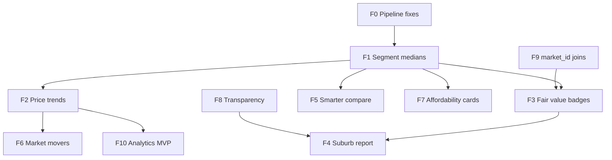

# Session Handover — 2026-06-27 (market intelligence roadmap)

## Goal

Strengthen Propo as a **market intelligence platform** for Zimbabwe — not a listing portal or chat search.

**Product pitch:** *Propo shows you where the market is, what's fair, and how it's changing — not just what's for rent today.*

**Explicitly out of scope:** natural-language / chat-based property search (WhatsApp and portals already cover conversational listing discovery; Propo's wedge is suburb-level context, trends, and fair-value signals).

---

## Problem (current behaviour)

| Layer | Today | Gap |
| ----- | ----- | --- |
| **Explore** | Budget vs suburb-wide median; type filter uses `*_count` but price is aggregate | Spec filters mislead (e.g. townhouse listings show, suburbs empty — see normalize_type bug) |
| **Suburb profile** | Point-in-time medians, yield, DOM, property mix, value listings | No historical trend; no "fair vs median" on listings |
| **Rankings** | Static leaderboards (yield, opportunity, DOM) | No "movers" (price change, supply shift) |
| **Compare** | Up to 3 pinned suburbs, aggregate metrics | No spec-aware compare; no trend sparklines |
| **History data** | `market_snapshots_daily`, `listing_snapshots` populated by daily pipeline | **Not exposed in web UI** |
| **Trust** | Confidence badge, methodology page, data freshness pill | Sample sizes and segment limits not surfaced on suburb pages |
| **Listings join** | Filter by suburb string equality | Mismatches vs `market_metrics` suburb names; no `market_id` on listings |

---

## Workspace

| Area | Path |
| ---- | ---- |
| Pipeline | `analytics/market_metrics.py`, `analytics/daily_metrics.py`, `analytics/sync_dashboard.py`, `analytics/ingest_supabase.py` |
| History DB | `analytics/history_db.py`, `supabase/migrations/001_history.sql` |
| Dashboard JSON | `data/market_metrics.json`, `data/rankings.json` |
| Web data layer | `web/src/lib/data-server.ts`, `web/src/app/api/` |
| Explore | `web/src/lib/explore.ts`, `web/src/hooks/use-explore-filters.ts` |
| Suburb UI | `suburb-profile.tsx`, `suburb-table.tsx`, `suburb-card.tsx`, `city-dashboard.tsx` |
| Listings UI | `listing-card.tsx`, `budget-listings.tsx`, `suburb-value-listings.tsx` |
| Compare / rankings | `compare-page.tsx`, `compare-table.tsx`, `rankings-page.tsx`, `web/src/lib/rankings.ts` |
| Related handovers | [2026-06-26-segment-medians-option-b.md](./2026-06-26-segment-medians-option-b.md), [2026-06-25-web-ux-listings-explore.md](./2026-06-25-web-ux-listings-explore.md) |

---

## Priority order (summary)



| Priority | Feature | Why first |
| -------- | ------- | --------- |
| **F0** | Pipeline type normalization fix | Unblocks townhouse (and all type filters) |
| **F1** | Segment medians | Makes all intelligence honest per spec |
| **F2** | Price & activity trends | Biggest differentiation vs portals; data already exists |
| **F3** | Fair value vs median on listings | Answers "is this price fair?" |
| **F6** | Market movers rankings | Homepage/social headline intelligence |
| **F4** | Suburb report export | Diaspora + agent credibility |
| **F5** | Smarter compare | Investor workflow |
| **F7** | Affordability insight cards | Sharpens budget-first home flow |
| **F8** | Transparency layer | Trust multiplier on everything |
| **F9** | `market_id` on listings | Data quality foundation |
| **F10** | Analytics MVP (optional) | Internal demand signals for B2B later |

**If only three ships in the next month:** F0 + F1 → F2 → F3.

---

## F0 — Pipeline type normalization fix

### Problem

`normalize_type()` in `market_metrics.py` checks `"house" in text` before `"townhouse"`, so every townhouse is counted as a house (`townhouse_count` stays 0). Same ordering bug in `daily_metrics.py` `bucket_property_type()`.

### Deliverable

Check **townhouse/cluster before house** in both files; optionally consolidate into `analytics/listing_utils.py` as shared `normalize_property_type()`.

### Files to touch

- [ ] `analytics/market_metrics.py` — `normalize_type()`
- [ ] `analytics/daily_metrics.py` — `bucket_property_type()`
- [ ] `analytics/listing_utils.py` (optional) — shared normalizer imported by both
- [ ] Run `npm run analytics:metrics` + spot-check `townhouse_count > 0` in `data/market_metrics.json`
- [ ] `npm run pipeline:supabase` or daily sync

### Verify

- Filter Explore by **Townhouse** → suburbs with townhouse inventory appear in budget lists
- `townhouse_count` non-zero for dense Harare suburbs in Supabase `market_metrics`

### Estimated effort

~1 hour

---

## F1 — Segment medians (spec-aware prices)

**Full spec:** [2026-06-26-segment-medians-option-b.md](./2026-06-26-segment-medians-option-b.md)

### Deliverable (short)

Pre-aggregate `(property_type, bedroom_bucket)` medians into `market_metrics.segments` JSONB. Explore budget, suburb cards/tables, and suburb profile (with query params) use segment price when filters are active.

### Files to touch

**Pipeline & DB**

- [ ] `supabase/migrations/006_market_segments.sql`
- [ ] `analytics/market_metrics.py` — segment rollups
- [ ] Regenerate `data/market_metrics.json`; sync Supabase

**Web**

- [ ] `web/src/lib/types.ts` — `MarketSegmentStats`, `segments?` on `MarketMetric`
- [ ] `web/src/lib/segments.ts` (new) — `resolveSegmentStats`, `priceForFilters`
- [ ] `web/src/lib/explore.ts` — budget uses segment median
- [ ] `web/src/lib/metric-tooltips.ts` — dynamic column labels
- [ ] `web/src/components/markets/explore-results.tsx`
- [ ] `web/src/components/markets/suburb-table.tsx`
- [ ] `web/src/components/mobile/suburb-list.tsx`
- [ ] `web/src/components/markets/suburb-card.tsx`
- [ ] `web/src/components/markets/suburb-profile.tsx` — read `type` / `bedroom` from URL
- [ ] Suburb links — preserve filter query string on navigate

### Verify

- Explore: 1-bed house rent $800 → in-budget suburbs match segment median, not suburb-wide median
- Suburb URL `/cities/harare/borrowdale?type=house&bedroom=1` shows spec medians

### Estimated effort

~8–12 hours (see segment handover)

---

## F2 — Price & activity trends

### Problem

Daily pipeline writes `market_snapshots_daily` (median price, listing count by city/suburb/listing_type/property_type per date). Web shows only latest point on suburb/city pages.

### Deliverable

Charts on suburb profile and city dashboard:

- Median rent / median sale over **30 / 90 / 180 days** (toggle or default 90d)
- Listing count trend (supply)
- Optional: median DOM trend if rolled into snapshots later

### Data approach

**Option A (recommended v1):** New API reads from Supabase `market_snapshots_daily` (already public read RLS).

**Option B:** Nightly rollup into `market_metrics` JSONB `trends: { rent_90d: [...], sale_90d: [...] }` for Worker-friendly single fetch — fewer API round-trips.

For v1, Option A is enough; aggregate at `(city, suburb, listing_type)` across property types or filter by segment in v2.

### New API

`GET /api/markets/[marketId]/trends?range=90d&mode=rent|buy`

Returns time series:

```json
{
  "points": [
    { "date": "2026-03-01", "median_price": 650, "listing_count": 42 }
  ],
  "pct_change_median": 8.2,
  "pct_change_listings": -5.0
}
```

### Files to touch

**Pipeline (optional enrichment)**

- [ ] `analytics/daily_metrics.py` — ensure suburb-level rollup row with `property_type = 'all'` for simpler charts (or aggregate in API)
- [ ] `supabase/migrations/007_trends_rollup.sql` (optional) — materialized view `market_trends_daily`

**Web**

- [ ] `web/src/lib/types.ts` — `MarketTrendPoint`, `MarketTrendsPayload`
- [ ] `web/src/lib/trends.ts` (new) — `% change`, date range helpers
- [ ] `web/src/lib/data-server.ts` — `fetchMarketTrends(marketId, range, mode)`
- [ ] `web/src/app/api/markets/[marketId]/trends/route.ts` (new)
- [ ] `web/src/components/markets/trend-chart.tsx` (new) — Recharts line/area
- [ ] `web/src/components/markets/suburb-profile.tsx` — trends section below metric cards
- [ ] `web/src/components/cities/city-dashboard.tsx` — city-level trend summary (top suburbs movers teaser)
- [ ] `web/src/lib/metric-tooltips.ts` — tooltip for trend charts
- [ ] `web/src/app/methodology/page.tsx` — note on trend calculation (daily snapshot medians)

### Verify

- Borrowdale suburb page shows 90d rent median chart with ≥4 weekly points after 30+ days of daily runs
- `% change` matches manual calc from `market_snapshots_daily` SQL

### Estimated effort

~6–8 hours

---

## F3 — Fair value badges on listings

### Problem

Listings show price but not context vs market. Users ask "is $720 rent fair for this suburb?"

### Deliverable

On every `ListingCard` (and compact variants), show badge when segment median is available:

- **Below median:** "12% below typical rent" (green/neutral)
- **Above median:** "18% above typical rent" (amber)
- **At median:** "Near suburb median" or hide badge

Use listing's `property_type`, `bedrooms`, `listing_type`, `suburb`/`city` to resolve segment via `resolveSegmentStats()` (F1) or suburb aggregate fallback.

### Logic (`web/src/lib/fair-value.ts` — new)

```ts
export function fairValueLabel(
  listingPrice: number,
  median: number | null,
  mode: "rent" | "buy"
): { label: string; pctDiff: number; variant: "below" | "above" | "neutral" } | null;
```

Threshold: show badge only if `|pctDiff| >= 5` and sample count ≥ `MIN_SEGMENT_LISTINGS`.

### Files to touch

- [ ] `web/src/lib/fair-value.ts` (new)
- [ ] `web/src/lib/segments.ts` — reuse resolver; may need market lookup by suburb+city
- [ ] `web/src/hooks/use-market-by-suburb.ts` (new, optional) — map suburb → `MarketMetric`
- [ ] `web/src/components/listings/listing-card.tsx` — badge UI
- [ ] `web/src/components/listings/budget-listings.tsx` — pass mode + markets context
- [ ] `web/src/components/listings/suburb-value-listings.tsx` — segment median already known from market
- [ ] `web/src/lib/metric-tooltips.ts` — "Fair value" tooltip

### Depends on

- F1 (segment medians) for accurate badges by type/bed
- F9 (optional) for reliable suburb → market join

### Verify

- Listing at $600 in suburb where 2-bed flat median rent is $700 shows ~14% below
- Listing with unknown type shows suburb-wide median fallback or no badge

### Estimated effort

~4–5 hours

---

## F4 — Suburb market report (shareable / export)

### Deliverable

"Download report" or print-optimized view for a suburb:

- Header: suburb, city, data freshness
- Current medians (rent, sale, yield, DOM) — spec-aware if query params set
- 90d trend mini-charts (F2)
- Property mix bar
- Top 4 value listings (F3 badges)
- Confidence + sample size disclaimer (F8)
- Methodology footnote

**v1:** CSS `@media print` + `/cities/[city]/[suburb]/report` route (no PDF lib).  
**v2:** `@react-pdf/renderer` or server PDF if needed.

### Files to touch

- [ ] `web/src/app/cities/[city]/[suburb]/report/page.tsx` (new)
- [ ] `web/src/components/markets/suburb-report.tsx` (new) — print layout
- [ ] `web/src/components/markets/suburb-profile.tsx` — "Export report" button
- [ ] Reuse: `trend-chart.tsx`, `property-mix-bar.tsx`, `suburb-value-listings.tsx`, `confidence-badge.tsx`
- [ ] `web/src/app/globals.css` — print styles

### Depends on

- F2 (trends), F8 (transparency copy)

### Verify

- Print preview fits A4; no nav chrome
- Shareable URL loads without auth

### Estimated effort

~4–6 hours

---

## F5 — Smarter compare

### Deliverable

Extend compare beyond aggregate pins:

1. **Spec selector** on compare page — mode + optional type + bedroom (reads/writes URL params like explore)
2. **Best/worst highlights** per metric row — reuse `getBestMarketId()` from `explore.ts` `COMPARE_METRICS`
3. **Optional v2:** sparkline per suburb column from F2 trends API

### Files to touch

- [ ] `web/src/components/compare/compare-page.tsx` — filter bar for spec
- [ ] `web/src/components/markets/compare-table.tsx` — spec-aware values via `resolveSegmentStats`; highlight best cell
- [ ] `web/src/components/mobile/compare-cards.tsx` — same
- [ ] `web/src/lib/explore.ts` — export/compare helpers for segment-aware `getValue`
- [ ] `web/src/lib/metric-tooltips.ts` — compare column labels when spec set
- [ ] `web/src/components/markets/trend-sparkline.tsx` (optional v2)

### Depends on

- F1 (segment medians)

### Verify

- Pin 3 suburbs, set "2 bed flat rent" → table shows segment medians; best rent highlighted

### Estimated effort

~4–5 hours (+2h for sparklines)

---

## F6 — Market movers (rankings v2)

### Deliverable

New rankings views (tabs on `/rankings` or separate `/rankings/movers`):

| Ranking | Definition |
| ------- | ---------- |
| **Rent risers** | Largest % increase in median rent over 90d |
| **Rent fallers** | Largest % decrease |
| **Sale movers** | Same for sale |
| **Supply surge** | Largest % increase in listing count |
| **DOM shift** | Biggest change in median DOM (requires DOM in snapshots or compute from listings history) |

Minimum data: ≥4 snapshot dates and confidence ≥ 40% (reuse `RANKINGS_MIN_CONFIDENCE`).

### Files to touch

**Pipeline / API**

- [ ] `web/src/lib/trends.ts` — `computeMovers(markets, snapshots, range)`
- [ ] `web/src/lib/data-server.ts` — `fetchMarketSnapshots()` or bulk trends query
- [ ] `web/src/app/api/rankings/movers/route.ts` (new) — precomputed movers JSON
- [ ] `analytics/rankings.py` (optional) — nightly `data/rankings_movers.json` for static fallback

**Web**

- [ ] `web/src/lib/types.ts` — `MoverEntry`
- [ ] `web/src/lib/rankings.ts` — movers sort/filter
- [ ] `web/src/components/rankings/movers-rankings.tsx` (new)
- [ ] `web/src/components/rankings/rankings-page.tsx` — tabs: Classic | Movers
- [ ] `web/src/app/rankings/page.tsx` — wire tabs
- [ ] `web/src/components/home/home-page.tsx` (optional) — "Biggest rent movers this quarter" teaser

### Depends on

- F2 (trends data accessible)

### Verify

- Suburb with known rising rent in snapshots appears in "Rent risers"
- Low-confidence suburbs excluded

### Estimated effort

~6–8 hours

---

## F7 — Affordability insight cards

### Deliverable

On home page (below budget controls or above "Top matches"), show 2–3 **insight cards** instead of only suburb grid:

- "In budget at $700 rent" — top suburb + median + yield snippet
- "Stretch option" — one suburb in stretch band with tradeoff copy ("Higher yield, 12% over budget")
- Deep link to explore with filters preserved

Copy is template-based (no LLM):

```
Greendale — $680 median rent (2-bed flat) · In budget · Yield 6.2%
Borrowdale — $920 median · Stretch · Stronger amenities
```

### Files to touch

- [ ] `web/src/lib/affordability-insights.ts` (new) — pick top in-budget + one stretch from `filterMarkets` + segment resolver
- [ ] `web/src/components/home/affordability-insights.tsx` (new)
- [ ] `web/src/components/home/home-page.tsx` — insert section
- [ ] Reuse `filterMarkets`, `rankExploreResults`, `priceForFilters` from explore + segments

### Depends on

- F1 (segment medians for accurate cards when type/bed selected)

### Verify

- Change budget slider → insight cards update
- Cards link to correct explore URL

### Estimated effort

~3–4 hours

---

## F8 — Transparency layer

### Deliverable

Surface data quality on suburb profile and listing cards:

- **Sample size:** "Based on 34 active rental listings" (mode-specific count)
- **Segment warning:** tooltip "Limited data (n=2)" when below `MIN_SEGMENT_LISTINGS`
- **Scope label:** "All property types" vs "2-bed flats only" when filters active
- **Freshness:** extend `DataFreshnessPill` context on suburb header
- **Honest limits:** methodology note — no borehole/pool/security attributes

### Files to touch

- [ ] `web/src/lib/constants.ts` — `MIN_SEGMENT_LISTINGS = 3`
- [ ] `web/src/components/markets/sample-size-badge.tsx` (new)
- [ ] `web/src/components/markets/confidence-badge.tsx` — optional `sampleCount` prop
- [ ] `web/src/components/markets/suburb-profile.tsx` — sample size + scope
- [ ] `web/src/components/markets/explore-results.tsx` — header explains aggregate vs segment
- [ ] `web/src/lib/metric-tooltips.ts` — sample size tooltips
- [ ] `web/src/app/methodology/page.tsx` — "Data limits" section

### Depends on

- F1 (segment counts)

### Verify

- Suburb with `rental_count: 2` for resolved segment shows limited-data warning
- Methodology page lists what is not in scrape

### Estimated effort

~3 hours

---

## F9 — `market_id` on listings (data join reliability)

### Problem

Listings filtered by suburb string; mismatches with `market_metrics` cause empty suburb listings and wrong fair-value lookups.

### Deliverable

- Add `market_id` to listings during ingest (derive from `city` + `suburb` → same key as `market_metrics.market_id`)
- Backfill existing rows in Supabase
- Web: prefer `market_id` join where available; keep string fallback

### Files to touch

**Pipeline**

- [ ] `analytics/clean_data.py` or ingest normalizer — set `market_id` on each listing
- [ ] `analytics/ingest_supabase.py` — upsert includes `market_id`
- [ ] `supabase/migrations/008_listings_market_id.sql` — column + index (if not already on `listings.market_id` from 001 — verify; 001 already has `market_id text` nullable)
- [ ] Backfill script or SQL update joining on normalized city/suburb

**Web**

- [ ] `web/src/lib/data-server.ts` — `fetchListings` filter by `market_id` when suburb page knows `market.market_id`
- [ ] `web/src/lib/types.ts` — ensure `Listing` includes `market_id?`
- [ ] `web/src/app/api/listings/route.ts` — accept `market_id` query param

### Verify

- Suburb profile listings count matches manual SQL for `market_id`
- Fewer empty `suburb-value-listings` on edge-case suburb names

### Estimated effort

~3–4 hours

---

## F10 — Analytics MVP (internal demand signals)

**Full spec (optional later):** see plan `anonymous_behavior_analytics_74398541.plan.md` in Cursor plans.

### Deliverable (minimal slice)

Track core events server-side for **your** product decisions and future B2B pitches — not a full dashboard in v1:

- Cookies + `/api/events` + Supabase `analytics_events` table
- Events: `explore_filter_change`, `explore_zero_results`, `suburb_click`, `listing_click`
- Query in Supabase SQL editor; defer `/insights` UI until traffic exists

### Files to touch

- [ ] `supabase/migrations/009_analytics.sql` (coordinate numbering with 006–008)
- [ ] `web/src/middleware.ts`, `web/src/app/api/events/route.ts`
- [ ] `web/src/lib/analytics/*`, instrumentation on explore + listing-card
- [ ] Consent banner (lightweight)

### Verify

- Events appear in Supabase after browse session
- No events when Supabase not configured (dev graceful no-op)

### Estimated effort

~8–12 hours MVP; full dashboard + revenue tab is v2

---

## Migration numbering (coordinate before apply)

| Migration | Feature | Notes |
| --------- | ------- | ----- |
| `006_market_segments.sql` | F1 | From segment handover |
| `007_trends_rollup.sql` | F2 | Optional view |
| `008_listings_market_id.sql` | F9 | Backfill only if needed (`market_id` may exist) |
| `009_analytics.sql` | F10 | Optional |

Check `001_history.sql` — `listings.market_id` column already exists; F9 may be **backfill + pipeline populate** only.

---

## What NOT to do

- **Do not** add chat / natural-language property search as primary UX
- **Do not** expand into a Facebook-style listing feed (explore listings panel was removed intentionally)
- **Do not** promise attributes not in scrape (borehole, walled, pool) on fair-value or reports
- **Do not** block F2/F3 on perfect segment data — ship F0+F1 first
- **Do not** build consumer email alerts without auth strategy

---

## Success criteria (platform-level)

1. User can answer **"where should I rent a 2-bed flat at $700?"** with segment-accurate suburbs (F0+F1+F7)
2. User can answer **"is this listing fairly priced?"** on listing cards (F3)
3. User can answer **"is Borrowdale getting more expensive?"** from suburb trend chart (F2)
4. User can **share/print a suburb report** for diaspora research (F4)
5. Rankings surface **movers**, not only static top yield (F6)
6. Every metric shows **how much data backs it** (F8)

---

## Estimated effort (total roadmap)

| Feature | Hours |
| ------- | ----- |
| F0 Pipeline fix | 1 |
| F1 Segment medians | 8–12 |
| F2 Trends | 6–8 |
| F3 Fair value | 4–5 |
| F4 Suburb report | 4–6 |
| F5 Smarter compare | 4–7 |
| F6 Market movers | 6–8 |
| F7 Affordability cards | 3–4 |
| F8 Transparency | 3 |
| F9 market_id joins | 3–4 |
| F10 Analytics MVP | 8–12 |
| **Core trio (F0+F1+F2+F3)** | **~20–26** |

---

## Commands

```powershell
cd C:\Users\Katiyo\Documents\GitHub\propo
.\.venv\Scripts\Activate.ps1

# After pipeline changes
npm run analytics:metrics
npm run analytics:build:db
npm run pipeline:supabase

# Daily history (trends depend on this running)
npm run daily

# Web verify
cd web
npm run dev
npm run build
```

---

## Suggested session order for agents

1. Read F0 + [segment handover](./2026-06-26-segment-medians-option-b.md) → implement F0 then F1
2. F2 trends API + suburb chart (unblocks F6)
3. F3 fair value badges
4. F8 transparency (quick win alongside F3)
5. F7 affordability cards on home
6. F6 movers rankings
7. F5 compare upgrades
8. F4 suburb report
9. F9 market_id backfill
10. F10 analytics when ready for B2B / internal ops
