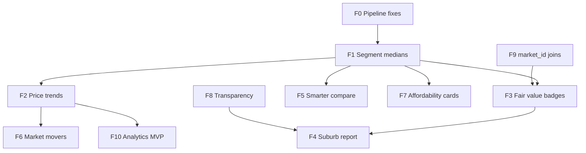

# Session Handover — 2026-06-27 (market intelligence roadmap)

## Goal

Strengthen Propo as a **market intelligence platform** for Zimbabwe — not a listing portal or chat search.

**Product pitch:** *Propo shows you where the market is, what's fair, and how it's changing — not just what's for rent today.*

**Explicitly out of scope:** natural-language / chat-based property search (WhatsApp and portals already cover conversational listing discovery; Propo's wedge is suburb-level context, trends, and fair-value signals).

---

## Ship status (2026-07-01)

| Feature | Status | Handover |
| ------- | ------ | -------- |
| **F0** Pipeline type normalization | ✅ Done | [2026-06-28-f0-f1-segment-explore-polish.md](./2026-06-28-f0-f1-segment-explore-polish.md) |
| **F1** Segment medians + Explore polish | ✅ Done | same |
| **F2** Price trends | ✅ Done | [2026-06-28-f2-trends-classifieds-prices.md](./2026-06-28-f2-trends-classifieds-prices.md) |
| **F3** Fair value badges | ✅ Done | [2026-06-29-f3-fair-value-movers-seo.md](./2026-06-29-f3-fair-value-movers-seo.md) |
| **F4** Suburb market report | ✅ Done | [2026-06-30-f4-f5-report-compare.md](./2026-06-30-f4-f5-report-compare.md) |
| **F5** Smarter compare | ✅ Done | same |
| **F6** Market movers rankings | ✅ Done | [2026-07-01-f6-movers-rankings.md](./2026-07-01-f6-movers-rankings.md) |
| **F7** Affordability insight cards | ✅ Done | below (F7 section) |
| **F8** Transparency layer | ✅ Done | below (F8 section) |
| **F9–F10** | Not started | below |

**Ancillary (not roadmap features):** listing thumbnails + `image_url` ([2026-06-29](./2026-06-29-listing-thumbnails-image-url.md), [2026-06-30 pipeline](./2026-06-30-pipeline-run-scraper-migration-fixes.md)); Open Graph SEO + city movers polish (F3 handover); classifieds ZIG→USD price fix (F2 handover); leaderboard confidence backfill + cheapest-rent fix (F6 handover).

**Next recommended:** F9 `market_id` backfill → F10 analytics MVP (optional).

---

## Problem (current behaviour)

| Layer | Today | Gap |
| ----- | ----- | --- |
| **Home** | Budget controls; **Budget insights** cards (in-budget + stretch); Top matches grid; movers teaser | — |
| **Explore** | Segment medians when type/bed set; fallback labeled; **Include suburb medians** switch; scope + aggregate vs segment copy in header; buy has no room | — |
| **Suburb profile** | Spec medians via `?type=&bedroom=`; 30/90/180d trend charts; fair-value badges; **printable report** at `/report`; sample size + scope + freshness on header | Segment-filtered trends (v2) |
| **Rankings** | Leaderboards + **Movers** tabs at `/rankings`; national 90d rent/sale/supply/DOM; city page movers teaser; nav link restored | Sample-size context on ranking cards (optional polish) |
| **Compare** | Up to 3 pinned suburbs; spec selector (mode + type + bed); segment-aware medians; best-value highlights | Trend sparklines (v2, deferred) |
| **History data** | `market_snapshots_daily` exposed via trends API on suburb/city pages | Segment-filtered trends; DOM trend line |
| **Trust** | Confidence badge (+ optional sample count); sample-size badges; scope labels; Explore aggregate vs segment copy; methodology **Data limits** section | — |
| **Listings join** | Filter by suburb string equality; `image_url` on listings; fair-value tooltips with n= | Mismatches vs `market_metrics` suburb names; no `market_id` join (F9) |

---

## Workspace

| Area | Path |
| ---- | ---- |
| Pipeline | `analytics/market_metrics.py`, `analytics/daily_metrics.py`, `analytics/sync_dashboard.py`, `analytics/ingest_supabase.py` |
| History DB | `analytics/history_db.py`, `supabase/migrations/001_history.sql` |
| Dashboard JSON | `data/market_metrics.json`, `data/rankings.json` |
| Web data layer | `web/src/lib/data-server.ts`, `web/src/app/api/` |
| Explore | `web/src/lib/explore.ts`, `web/src/hooks/use-explore-filters.ts` |
| Home | `web/src/components/home/home-page.tsx`, `affordability-insights.tsx`, `web/src/lib/affordability-insights.ts` |
| Suburb UI | `suburb-profile.tsx`, `suburb-table.tsx`, `suburb-card.tsx`, `sample-size-badge.tsx`, `city-dashboard.tsx` |
| Listings UI | `listing-card.tsx`, `budget-listings.tsx`, `suburb-value-listings.tsx` |
| Compare / rankings | `compare-page.tsx`, `compare-table.tsx`, `rankings-page.tsx`, `web/src/lib/rankings.ts` |
| Related handovers | [2026-06-28-f0-f1-segment-explore-polish.md](./2026-06-28-f0-f1-segment-explore-polish.md), [2026-06-26-segment-medians-option-b.md](./2026-06-26-segment-medians-option-b.md), [2026-06-25-web-ux-listings-explore.md](./2026-06-25-web-ux-listings-explore.md) |

---

## Priority order (summary)



| Priority | Feature | Why first |
| -------- | ------- | --------- |
| **F0** | Pipeline type normalization fix | Unblocks townhouse (and all type filters) |
| **F1** | Segment medians | Makes all intelligence honest per spec |
| **F2** | Price & activity trends | Biggest differentiation vs portals; data already exists |
| **F3** | Fair value vs median on listings | Answers "is this price fair?" |
| **F6** | Market movers rankings | Homepage/social headline intelligence |
| **F4** | Suburb report export | Diaspora + agent credibility |
| **F5** | Smarter compare | Investor workflow |
| **F7** | Affordability insight cards | Sharpens budget-first home flow |
| **F8** | Transparency layer | Trust multiplier on everything |
| **F9** | `market_id` on listings | Data quality foundation |
| **F10** | Analytics MVP (optional) | Internal demand signals for B2B later |

**If only three ships in the next month:** ~~F0–F8 core intelligence~~ **shipped** — next: F9 → F10 (optional).

---

## F0 — Pipeline type normalization fix ✅

### Problem

`normalize_type()` in `market_metrics.py` checks `"house" in text` before `"townhouse"`, so every townhouse is counted as a house (`townhouse_count` stays 0). Same ordering bug in `daily_metrics.py` `bucket_property_type()`.

### Deliverable

Check **townhouse/cluster before house** in both files; optionally consolidate into `analytics/listing_utils.py` as shared `normalize_property_type()`.

### Files to touch

- [x] `analytics/market_metrics.py` — uses `listing_utils.normalize_property_type()`
- [x] `analytics/daily_metrics.py` — uses shared normalizer
- [x] `analytics/listing_utils.py` — shared `normalize_property_type()`
- [x] `package.json` — `analytics:metrics` runs as `python -m analytics.market_metrics`
- [x] Run `npm run analytics:metrics` + spot-check `townhouse_count > 0` in `data/market_metrics.json`
- [x] `sync_dashboard` (metrics synced); full `pipeline:supabase` ingest may need retry

### Verify

- Filter Explore by **Townhouse** → suburbs with townhouse inventory appear in budget lists
- `townhouse_count` non-zero for dense Harare suburbs in Supabase `market_metrics`

### Estimated effort

~1 hour

---

## F1 — Segment medians (spec-aware prices) ✅

**Full spec:** [2026-06-26-segment-medians-option-b.md](./2026-06-26-segment-medians-option-b.md)  
**Ship notes:** [2026-06-28-f0-f1-segment-explore-polish.md](./2026-06-28-f0-f1-segment-explore-polish.md)

### Deliverable (short)

Pre-aggregate `(property_type, bedroom_bucket)` medians into `market_metrics.segments` JSONB. Explore budget, suburb cards/tables, and suburb profile (with query params) use segment price when filters are active.

### Files to touch

**Pipeline & DB**

- [x] `supabase/migrations/006_market_segments.sql` (applied on Supabase)
- [x] `analytics/market_metrics.py` — segment rollups
- [x] Regenerate `data/market_metrics.json`; sync Supabase

**Web**

- [x] `web/src/lib/types.ts` — `MarketSegmentStats`, `segments?` on `MarketMetric`
- [x] `web/src/lib/segments.ts` (new) — `resolveSegmentStats`, `priceForFilters`
- [x] `web/src/lib/explore.ts` — budget uses segment median
- [x] `web/src/lib/metric-tooltips.ts` — dynamic column labels
- [x] `web/src/components/markets/explore-results.tsx`
- [x] `web/src/components/markets/suburb-table.tsx`
- [x] `web/src/components/mobile/suburb-list.tsx`
- [x] `web/src/components/markets/suburb-card.tsx`
- [x] `web/src/components/markets/suburb-profile.tsx` — read `type` / `bedroom` from URL
- [x] `web/src/lib/slug.ts` — suburb links preserve filter query string

### F1 polish (shipped with F1, 2026-06-28)

- [x] Suburb median fallback labeling — `segment-price-note.tsx`, table "Suburb median" sublabel
- [x] **Include suburb medians** switch (`hideSuburbMedianFallback`, default hide; URL `showfallback=1`)
- [x] **Show suburbs with less data** switch (replaces thin-markets button)
- [x] `web/src/components/ui/switch.tsx`
- [x] Buy mode: no `room`; room → 1 bed; `normalizeExploreFilters()`

**Still open (optional)**

- [ ] `web/src/lib/segments.test.ts` (optional)

### Verify

- Explore: 1-bed house rent $800 → in-budget suburbs match segment median, not suburb-wide median
- Suburb URL `/cities/harare/borrowdale?type=house&bedroom=1` shows spec medians

### Estimated effort

~8–12 hours (see segment handover)

---

## F2 — Price & activity trends ✅

**Ship notes:** [2026-06-28-f2-trends-classifieds-prices.md](./2026-06-28-f2-trends-classifieds-prices.md) (city movers polish in F3 handover)

### Problem

Daily pipeline writes `market_snapshots_daily` (median price, listing count by city/suburb/listing_type/property_type per date). Web showed only latest point on suburb/city pages.

### Deliverable

Charts on suburb profile and city dashboard:

- Median rent / median sale over **30 / 90 / 180 days** (toggle or default 90d)
- Listing count trend (supply)
- Optional: median DOM trend if rolled into snapshots later

### Data approach

**Option A (recommended v1):** New API reads from Supabase `market_snapshots_daily` (already public read RLS).

**Option B:** Nightly rollup into `market_metrics` JSONB `trends: { rent_90d: [...], sale_90d: [...] }` for Worker-friendly single fetch — fewer API round-trips.

For v1, Option A is enough; aggregate at `(city, suburb, listing_type)` across property types or filter by segment in v2.

### New API

`GET /api/markets/[marketId]/trends?range=90d&mode=rent|buy`

Returns time series:

```json
{
  "points": [
    { "date": "2026-03-01", "median_price": 650, "listing_count": 42 }
  ],
  "pct_change_median": 8.2,
  "pct_change_listings": -5.0
}
```

### Files to touch

**Pipeline (optional enrichment)**

- [ ] `analytics/daily_metrics.py` — ensure suburb-level rollup row with `property_type = 'all'` for simpler charts (or aggregate in API)
- [ ] `supabase/migrations/007_trends_rollup.sql` (optional) — materialized view `market_trends_daily`

**Web**

- [x] `web/src/lib/types.ts` — `MarketTrendPoint`, `MarketTrendsPayload`, `TrendMover`
- [x] `web/src/lib/trends.ts` (new) — `% change`, date range helpers, movers logic
- [x] `web/src/lib/data-server.ts` — `fetchMarketTrends`, `fetchCityTrendMovers`
- [x] `web/src/app/api/markets/[marketId]/trends/route.ts` (new)
- [x] `web/src/app/api/cities/[city]/trend-movers/route.ts` (new) — city movers teaser
- [x] `web/src/components/markets/trend-chart.tsx` (new) — Recharts area
- [x] `web/src/components/markets/suburb-trends-section.tsx` (new) — 30/90/180d + rent/sale toggle
- [x] `web/src/components/markets/suburb-profile.tsx` — trends section wired
- [x] `web/src/components/cities/city-trend-movers.tsx` (new) — 90d movers + rent/sale toggle
- [x] `web/src/components/cities/city-dashboard.tsx` — city-level movers teaser
- [x] `web/src/lib/metric-tooltips.ts` — tooltip for trend charts
- [x] `web/src/app/methodology/page.tsx` — note on trend calculation (daily snapshot medians)
- [x] `analytics/trends_fetch.py` — local SQLite fallback when Supabase not configured

**Deferred (v2)**

- [ ] Segment-filtered trends (type/bed on chart)
- [ ] DOM trend line

### Verify

- Borrowdale suburb page shows 90d rent median chart with ≥4 weekly points after 30+ days of daily runs
- `% change` matches manual calc from `market_snapshots_daily` SQL

### Estimated effort

~6–8 hours

---

## F3 — Fair value badges on listings ✅

**Ship notes:** [2026-06-29-f3-fair-value-movers-seo.md](./2026-06-29-f3-fair-value-movers-seo.md)

### Problem

Listings showed price but not context vs market. Users ask "is $720 rent fair for this suburb?"

### Deliverable

On every `ListingCard` (and compact variants), show badge when segment median is available:

- **Below median:** "12% below typical rent" (green/neutral)
- **Above median:** "18% above typical rent" (amber)
- **At median:** "Near suburb median" or hide badge

Use listing's `property_type`, `bedrooms`, `listing_type`, `suburb`/`city` to resolve segment via `resolveSegmentStats()` (F1) or suburb aggregate fallback.

### Logic (`web/src/lib/fair-value.ts` — new)

```ts
export function fairValueLabel(
  listingPrice: number,
  median: number | null,
  mode: "rent" | "buy"
): { label: string; pctDiff: number; variant: "below" | "above" | "neutral" } | null;
```

Threshold: show badge only if `|pctDiff| >= 5` and sample count ≥ `MIN_SEGMENT_LISTINGS`.

### Files to touch

- [x] `web/src/lib/fair-value.ts` (new) — `fairValueLabel`, `resolveFairValueForListing`
- [x] `web/src/lib/segments.ts` — reuse resolver
- [x] `web/src/hooks/use-market-lookup.ts` (new) — map `city|suburb` → `MarketMetric`
- [x] `web/src/components/listings/listing-card.tsx` — badge UI
- [x] `web/src/components/listings/budget-listings.tsx` — pass mode + markets context
- [x] `web/src/components/listings/suburb-value-listings.tsx` — segment median already known from market
- [x] `web/src/lib/metric-tooltips.ts` — `FAIR_VALUE_TOOLTIP`, `fairValueTooltipDetail()`
- [x] `web/src/lib/constants.ts` — `MIN_SEGMENT_LISTINGS = 3` (shared with F8)

### Depends on

- F1 (segment medians) for accurate badges by type/bed
- F9 (optional) for reliable suburb → market join

### Verify

- Listing at $600 in suburb where 2-bed flat median rent is $700 shows ~14% below
- Listing with unknown type shows suburb-wide median fallback or no badge

### Estimated effort

~4–5 hours

---

## F4 — Suburb market report (shareable / export) ✅

**Ship notes:** [2026-06-30-f4-f5-report-compare.md](./2026-06-30-f4-f5-report-compare.md)

### Deliverable

"Download report" or print-optimized view for a suburb:

- Header: suburb, city, data freshness
- Current medians (rent, sale, yield, DOM) — spec-aware if query params set
- 90d trend mini-charts (F2)
- Property mix bar
- Top 4 value listings (F3 badges)
- Confidence + sample size disclaimer (F8)
- Methodology footnote

**v1:** CSS `@media print` + `/cities/[city]/[suburb]/report` route (no PDF lib).  
**v2:** `@react-pdf/renderer` or server PDF if needed.

### Files to touch

- [x] `web/src/app/cities/[city]/[suburb]/report/page.tsx` (new) — server fetch trends + listings
- [x] `web/src/components/markets/suburb-report.tsx` (new) — print layout
- [x] `web/src/components/markets/suburb-report-trends.tsx` (new) — 90d rent + sale charts
- [x] `web/src/components/markets/suburb-report-actions.tsx` (new) — Print / Save PDF
- [x] `web/src/components/markets/suburb-profile.tsx` — "Export report" button (desktop + mobile)
- [x] `web/src/lib/slug.ts` — `suburbReportPath()`
- [x] Reuse: `trend-chart.tsx`, `property-mix-bar.tsx`, `listing-card.tsx`, `confidence-badge.tsx`
- [x] `web/src/app/globals.css` — `@media print` A4 styles
- [x] `web/src/components/layout/app-shell.tsx` — hide chrome on print

### Depends on

- F2 (trends), F8 (transparency copy)

### Verify

- Print preview fits A4; no nav chrome
- Shareable URL loads without auth

### Estimated effort

~4–6 hours

---

## F5 — Smarter compare ✅

**Ship notes:** [2026-06-30-f4-f5-report-compare.md](./2026-06-30-f4-f5-report-compare.md)

### Deliverable

Extend compare beyond aggregate pins:

1. **Spec selector** on compare page — mode + optional type + bedroom (reads/writes URL params like explore)
2. **Best/worst highlights** per metric row — reuse `getBestMarketId()` from `explore.ts` `COMPARE_METRICS`
3. **Optional v2:** sparkline per suburb column from F2 trends API

### Files to touch

- [x] `web/src/components/compare/compare-page.tsx` — filter bar + spec-aware description
- [x] `web/src/components/compare/compare-filter-bar.tsx` (new) — mode + type + bedroom
- [x] `web/src/hooks/use-compare-filters.ts` (new) — URL params on `/compare`
- [x] `web/src/components/markets/compare-table.tsx` — spec-aware values; best cell highlight; fallback sublabel
- [x] `web/src/components/mobile/compare-cards.tsx` — same
- [x] `web/src/lib/explore.ts` — `buildCompareMetrics()`, segment-aware `getValue`
- [x] `web/src/lib/metric-tooltips.ts` — `compareMetricTooltip()` when spec set
- [x] `web/src/lib/types.ts` + `constants.ts` — `CompareFilters`, `normalizeCompareFilters()`
- [ ] `web/src/components/markets/trend-sparkline.tsx` (optional v2 — deferred)

### Depends on

- F1 (segment medians)

### Verify

- Pin 3 suburbs, set "2 bed flat rent" → table shows segment medians; best rent highlighted

### Estimated effort

~4–5 hours (+2h for sparklines)

---

## F6 — Market movers (rankings v2) ✅

**Ship notes:** [2026-07-01-f6-movers-rankings.md](./2026-07-01-f6-movers-rankings.md)

### Deliverable

Rankings views at `/rankings` — **Leaderboards | Movers** tabs (`?tab=movers`):

| Ranking | Definition |
| ------- | ---------- |
| **Rent risers** | Largest % increase in median rent over 90d |
| **Rent fallers** | Largest % decrease |
| **Sale movers** | Same for sale |
| **Supply surge** | Largest % increase in listing count |
| **DOM shift** | Biggest change in median DOM |

Minimum data: ≥4 snapshot dates; movers require confidence ≥ `RANKINGS_MIN_CONFIDENCE` (40%). Classic leaderboards use `LEADERBOARD_MIN_CONFIDENCE` (20%) with backfill when &lt;5 pass.

### Files to touch

**Pipeline / API**

- [x] `web/src/lib/trends.ts` — `computeMoversFromSeries`, `computeSupplyMoversFromSeries`, `computeDomMoversFromSeries`
- [x] `web/src/lib/data-server.ts` — `fetchCityTrendMovers`, `fetchNationalTrendMovers`
- [x] `web/src/app/api/cities/[city]/trend-movers/route.ts` — city-level movers
- [x] `web/src/app/api/rankings/movers/route.ts` — national movers API
- [x] `analytics/trends_fetch.py` — `national-movers` CLI fallback
- [ ] `analytics/rankings.py` nightly `data/rankings_movers.json` (optional — deferred)

**Web**

- [x] `web/src/lib/types.ts` — `TrendMover`, `MarketMoversRankingsPayload`
- [x] `web/src/lib/rankings.ts` — `filterMoversPayload`, `filterRankingsByConfidence` (leaderboard backfill)
- [x] `web/src/lib/constants.ts` — `LEADERBOARD_MIN_CONFIDENCE` (20) vs `RANKINGS_MIN_CONFIDENCE` (40)
- [x] `web/src/components/cities/city-trend-movers.tsx` — city page movers UI
- [x] `web/src/components/rankings/movers-rankings.tsx`
- [x] `web/src/components/rankings/rankings-page.tsx` — Leaderboards | Movers tabs
- [x] `web/src/app/rankings/page.tsx` — server fetch movers + classic rankings
- [x] `web/src/components/home/home-movers-teaser.tsx` — home rent movers teaser
- [x] `web/src/components/layout/app-sidebar.tsx` + `mobile-tab-bar.tsx` — Rankings nav restored

**Leaderboard polish (shipped with F6)**

- [x] `analytics/rankings.py` — `cheapest_markets` ranks by `median_rent` (was sale price)
- [x] DOM list UI reads `average_days_on_market_*` from rankings JSON
- [x] Regenerate `data/rankings.json` after pipeline fix

### Depends on

- F2 (trends data accessible)

### Verify

- `/rankings?tab=movers` — rent risers/fallers populated when snapshot history exists
- Low-confidence suburbs excluded from movers (40%)
- All six classic leaderboard cards show entries (20% + backfill)
- Rankings link visible in sidebar and mobile tab bar

### Estimated effort

~6–8 hours (shipped 2026-07-01)

---

## F7 — Affordability insight cards ✅

**Ship notes:** 2026-07-01 — home **Budget insights** section between budget controls and Top matches.

### Deliverable

On home page (below budget controls or above "Top matches"), show 2–3 **insight cards** in addition to the suburb grid:

- "In budget at $700 rent" — top suburb + median + yield snippet
- "Stretch option" — one suburb in stretch band with tradeoff copy ("Higher yield, 12% over budget")
- Deep link to explore with filters preserved

Copy is template-based (no LLM):

```
Greendale — $680 median rent (2-bed flat) · In budget · Yield 6.2%
Borrowdale — $920 median · Stretch · Stronger amenities
```

### Files to touch

- [x] `web/src/lib/affordability-insights.ts` (new) — pick top in-budget + one stretch from `filterMarkets` + segment resolver
- [x] `web/src/components/home/affordability-insights.tsx` (new)
- [x] `web/src/components/home/home-page.tsx` — insert section
- [x] Reuse `filterMarkets`, `rankExploreResults`, `priceForFilters` from explore + segments

### Depends on

- F1 (segment medians for accurate cards when type/bed selected)

### Verify

- Change budget slider → insight cards update
- "Explore matches" link preserves mode/budget/type filters; cards link to suburb profile with segment query params

### Estimated effort

~3–4 hours (shipped 2026-07-01)

---

## F8 — Transparency layer ✅

**Ship notes:** 2026-07-01 — suburb profile header, Explore scope copy, methodology Data limits.

### Deliverable

Surface data quality on suburb profile and listing cards:

- **Sample size:** "Based on 34 active rental listings" (mode-specific count)
- **Segment warning:** tooltip "Limited data (n=2)" when below `MIN_SEGMENT_LISTINGS`
- **Scope label:** "All property types" vs "2-bed flats only" when filters active
- **Freshness:** extend `DataFreshnessPill` context on suburb header
- **Honest limits:** methodology note — no borehole/pool/security attributes

### Files to touch

- [x] `web/src/lib/constants.ts` — `MIN_SEGMENT_LISTINGS = 3` (shipped with F3)
- [x] `web/src/components/markets/sample-size-badge.tsx` (new) — `SampleSizeBadge`, `ScopeLabel`
- [x] `web/src/components/markets/confidence-badge.tsx` — optional `sampleCount` + `sampleMode` props
- [x] `web/src/components/markets/suburb-profile.tsx` — sample size + scope + freshness
- [x] `web/src/components/markets/explore-results.tsx` — header explains aggregate vs segment
- [x] `web/src/lib/metric-tooltips.ts` — `sampleSizeLabel`, `segmentLimitedDataTooltip`, `exploreScopeDescription`
- [x] `web/src/lib/segments.ts` — `dataScopeLabel()`
- [x] `web/src/components/layout/data-freshness-pill.tsx` — optional `prefix` prop
- [x] `web/src/app/methodology/page.tsx` — "Data limits" section

**Deferred (optional polish)**

- [ ] Sample-size context on rankings / mover cards

### Depends on

- F1 (segment counts)

### Verify

- Suburb with `rental_count: 2` for resolved segment shows limited-data warning
- Methodology page lists what is not in scrape
- Listing fair-value tooltips already expose n= and aggregate vs segment basis (F3)

### Estimated effort

~3 hours (shipped 2026-07-01)

---

## F9 — `market_id` on listings (data join reliability)

### Problem

Listings filtered by suburb string; mismatches with `market_metrics` cause empty suburb listings and wrong fair-value lookups.

### Deliverable

- Add `market_id` to listings during ingest (derive from `city` + `suburb` → same key as `market_metrics.market_id`)
- Backfill existing rows in Supabase
- Web: prefer `market_id` join where available; keep string fallback

### Files to touch

**Pipeline**

- [ ] `analytics/clean_data.py` or ingest normalizer — set `market_id` on each listing
- [ ] `analytics/ingest_supabase.py` — upsert includes `market_id`
- [ ] `supabase/migrations/008_listings_market_id.sql` — column + index (if not already on `listings.market_id` from 001 — verify; 001 already has `market_id text` nullable)
- [ ] Backfill script or SQL update joining on normalized city/suburb

**Web**

- [ ] `web/src/lib/data-server.ts` — `fetchListings` filter by `market_id` when suburb page knows `market.market_id`
- [ ] `web/src/lib/types.ts` — ensure `Listing` includes `market_id?`
- [ ] `web/src/app/api/listings/route.ts` — accept `market_id` query param

### Verify

- Suburb profile listings count matches manual SQL for `market_id`
- Fewer empty `suburb-value-listings` on edge-case suburb names

### Estimated effort

~3–4 hours

---

## F10 — Analytics MVP (internal demand signals)

**Full spec (optional later):** see plan `anonymous_behavior_analytics_74398541.plan.md` in Cursor plans.

### Deliverable (minimal slice)

Track core events server-side for **your** product decisions and future B2B pitches — not a full dashboard in v1:

- Cookies + `/api/events` + Supabase `analytics_events` table
- Events: `explore_filter_change`, `explore_zero_results`, `suburb_click`, `listing_click`
- Query in Supabase SQL editor; defer `/insights` UI until traffic exists

### Files to touch

- [ ] `supabase/migrations/009_analytics.sql` (coordinate numbering with 006–008)
- [ ] `web/src/middleware.ts`, `web/src/app/api/events/route.ts`
- [ ] `web/src/lib/analytics/*`, instrumentation on explore + listing-card
- [ ] Consent banner (lightweight)

### Verify

- Events appear in Supabase after browse session
- No events when Supabase not configured (dev graceful no-op)

### Estimated effort

~8–12 hours MVP; full dashboard + revenue tab is v2

---

## Migration numbering (coordinate before apply)

| Migration | Feature | Notes |
| --------- | ------- | ----- |
| `006_market_segments.sql` | F1 | ✅ Applied on Supabase (2026-06-28) |
| `007_listing_image_url.sql` | Listings UX | ✅ Applied on Supabase (2026-06-30) — not F2 rollup |
| `007_trends_rollup.sql` | F2 | Optional view — not applied; API aggregates at read time |
| `008_listings_market_id.sql` | F9 | Backfill only if needed (`market_id` may exist) |
| `009_analytics.sql` | F10 | Optional |

Check `001_history.sql` — `listings.market_id` column already exists; F9 may be **backfill + pipeline populate** only.

---

## What NOT to do

- **Do not** add chat / natural-language property search as primary UX
- **Do not** expand into a Facebook-style listing feed (explore listings panel was removed intentionally)
- **Do not** promise attributes not in scrape (borehole, walled, pool) on fair-value or reports
- **Do not** block F2/F3 on perfect segment data — F0+F1 shipped; fallback UX in place
- **Do not** build consumer email alerts without auth strategy

---

## Success criteria (platform-level)

1. User can answer **"where should I rent a 2-bed flat at $700?"** with segment-accurate suburbs ✅ (F0+F1+F7 home insight cards)
2. User can answer **"is this listing fairly priced?"** on listing cards ✅ (F3)
3. User can answer **"is Borrowdale getting more expensive?"** from suburb trend chart ✅ (F2)
4. User can **share/print a suburb report** for diaspora research ✅ (F4)
5. Rankings surface **movers**, not only static top yield ✅ (F6)
6. Every metric shows **how much data backs it** ✅ (F8 sample size, scope, methodology limits)

---

## Estimated effort (total roadmap)

| Feature | Hours |
| ------- | ----- |
| F0 Pipeline fix | 1 |
| F1 Segment medians | 8–12 |
| F2 Trends | 6–8 |
| F3 Fair value | 4–5 |
| F4 Suburb report | 4–6 |
| F5 Smarter compare | 4–7 |
| F6 Market movers | 6–8 |
| F7 Affordability cards | 3–4 |
| F8 Transparency | 3 |
| F9 market_id joins | 3–4 |
| F10 Analytics MVP | 8–12 |
| **Core trio (F0+F1+F2+F3)** | **~20–26** |

---

## Commands

```powershell
cd C:\Users\Katiyo\Documents\GitHub\propo
.\.venv\Scripts\Activate.ps1

# After pipeline changes
npm run analytics:metrics
npm run analytics:build:db
npm run pipeline:supabase

# Daily history (trends depend on this running)
npm run daily

# Web verify
cd web
npm run dev
npm run build
```

---

## Suggested session order for agents

1. ~~F0 + F1~~ — done; see [2026-06-28 handover](./2026-06-28-f0-f1-segment-explore-polish.md)
2. ~~F2 trends API + suburb chart~~ — done; see [2026-06-28 handover](./2026-06-28-f2-trends-classifieds-prices.md)
3. ~~F3 fair value badges~~ — done; see [2026-06-29 handover](./2026-06-29-f3-fair-value-movers-seo.md)
4. ~~F4 suburb report~~ — done (2026-06-30)
5. ~~F5 compare upgrades~~ — done (2026-06-30)
6. ~~F6 movers rankings page~~ — done (2026-07-01); see [handover](./2026-07-01-f6-movers-rankings.md)
7. ~~F8 transparency~~ — done (2026-07-01)
8. ~~F7 affordability cards on home~~ — done (2026-07-01)
9. **F9** market_id backfill
10. **F10** analytics when ready for B2B / internal ops
