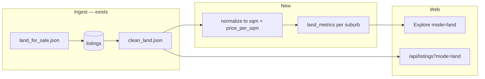
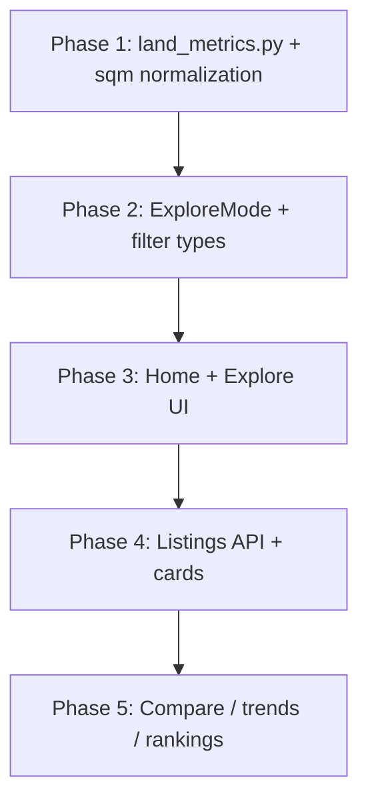

# Land mode plan — Rent | Buy | Land

> **Note (2026-07-05):** Rankings land leaderboards moved from `?tab=land` to **Land lens** on `/rankings?mode=land`. Invest is a fourth lens — see [2026-07-05-user-lens-shipped.md](./2026-07-05-user-lens-shipped.md).

**Date:** 2026-07-03  
**Status:** Phase 5 done (2026-07-03) — land mode complete end-to-end  
**Goal:** Add land/stands as a third top-level explore mode, standardized on **price per sqm**, alongside existing rent and buy flows.

---

## Summary

Propo should expose residential land the same way it exposes rent and buy: suburb-level medians, budget filtering, and active listings. Land is **not** a property type under Buy — it is sale-only, has no bedroom/type segmentation, and uses different budget semantics ($/sqm vs total house price).

**Recommended UX:** a third mode toggle — **Rent | Buy | Land** — mirroring the existing rent/buy pattern across home, explore, filters, and listings.

**Product pitch:** *See where stands are affordable per square metre, compare suburbs on land prices, and browse active stand listings — not mixed into house sale medians.*

---

## Current state

| Layer | Today | Gap |
| ----- | ----- | --- |
| **Scrapers** | `data/land_for_sale.json`, `data/property_co_land_for_sale.json` | — |
| **Ingest** | Land ingested to SQLite/Supabase with `land_size`, `land_size_unit`; exported to `data/clean_land.json` | No aggregated suburb metrics |
| **Market metrics** | `analytics/market_metrics.py` builds rent/buy suburb stats from `clean_rentals.json` + `clean_sales.json` | `residential_land` explicitly excluded in `ingest.py` export and `segment_property_type()` |
| **Web types** | `ExploreMode = "rent" \| "buy"` in `web/src/lib/types.ts` | No land mode |
| **Filters UI** | Rent/Buy toggle in home, explore, compare | No land toggle |
| **Listings API** | `GET /api/listings?mode=rent\|buy` | `isLandPropertyType()` filters land **out** in `data-server.ts` |
| **Listing cards** | Price, beds, DOM | No stand size or $/sqm |

### Data coverage (2026-07-03 snapshot)

From `data/clean_land.json`:

| Metric | Value |
| ------ | ----- |
| Total land listings | ~4,811 |
| With `land_size` + unit | ~4,802 |
| Computable $/sqm | ~4,645 |
| Median $/sqm | ~$47 |
| Size units | `sqm` (majority), `acre`, `ha` |

Land is ingested and queryable; the web app simply has no aggregates or UI path to show it.

---

## Why a third mode (not a property type)

| Concern | Rent / Buy | Land |
| ------- | ---------- | ---- |
| Listing type | Rent and/or sale | Sale only |
| Segmentation | Property type, bedrooms | Stand size (sqm) |
| Budget | $/month or total purchase price | $/sqm (or total + min size) |
| Derived metrics | Yield, opportunity score | Not applicable |
| Data export | `clean_rentals.json`, `clean_sales.json` | `clean_land.json` (already separate) |

Mixing land into `median_sale_price` would pollute house comparisons. A dedicated mode keeps suburb tables and rankings honest.

---

## Architecture



Keep land metrics **separate** from `build_market_metrics()` so house/rent medians stay clean.

---

## Phase 1 — Data: normalize and aggregate

**New file:** `analytics/land_metrics.py` (or extend pipeline with a dedicated step)

### Per-listing normalization

1. Normalize `land_size` to **sqm**:
   - `sqm` / `m2` → as-is
   - `acre` → × 4,046.86
   - `ha` → × 10,000
2. Derive:
   - `land_size_sqm`
   - `price_per_sqm = price / land_size_sqm` (only when size is known and > 0)
3. Exclude outliers / bad data (sane bounds TBD — e.g. $1–$500/sqm, 50–50,000 sqm).

### Per-suburb aggregation (`market_id`)

| Field | Description |
| ----- | ----------- |
| `land_count` | Active land listings in suburb |
| `median_price_per_sqm` | Primary compare metric |
| `average_price_per_sqm` | Optional |
| `minimum_price_per_sqm` | Optional |
| `maximum_price_per_sqm` | Optional |
| `median_days_on_market_land` | From listing DOM |
| `confidence_score` | Reuse existing count-based logic |

Optional size bands for v2: `0–500`, `500–1000`, `1000+` sqm segments.

### Output

- Local: `data/land_metrics.json`
- Supabase: new `land_metrics` table (migration) **or** extra columns on `market_metrics`

**Recommendation:** separate `land_metrics` table keyed by `market_id` — keeps concerns isolated and avoids widening `MarketMetric` with many nullable land fields that are N/A for rent-only suburbs.

### Pipeline wiring

- Run after `export_current_json()` in ingest flow
- Sync to Supabase alongside `market_metrics` (mirror `analytics/sync_dashboard.py` pattern)
- Do **not** add land to `clean_sales.json` or existing sale aggregates

### Phase 1 shipped (2026-07-03)

| Deliverable | Path |
| ----------- | ---- |
| Size / $/sqm helpers | `analytics/land_utils.py` |
| Suburb aggregation | `analytics/land_metrics.py` |
| Output JSON | `data/land_metrics.json` (313 suburbs, 4811 listings, 4564 priced) |
| Supabase migration | `supabase/migrations/011_land_metrics.sql` |
| Dashboard sync | `analytics/sync_dashboard.py` → `sync_land_metrics()` |
| npm script | `npm run analytics:land` (included in `analytics:build` / `analytics:build:db`) |
| DOM on land export | `analytics/ingest.py` `_to_land_shape()` includes `days_on_market` (populates on next ingest) |

Apply migration **011** on production Supabase, then run `npm run analytics:land` and `pipeline:supabase` (or full `pipeline:cloud`) to sync.

---

## Phase 2 — Types and filter model

### Core type change

```ts
// web/src/lib/types.ts
export type ExploreMode = "rent" | "buy" | "land";
```

### `ExploreFilters` when `mode === "land"`

| Control | Behavior |
| ------- | -------- |
| Property type buttons | Hidden |
| Bedroom filter | Hidden |
| Budget slider | **$/sqm** (primary) |
| City filter | Unchanged |
| Confidence / fallback toggles | Adapt or hide suburb-median fallback (no segments for land in v1) |

### Budget constants (suggested starting points)

```ts
export const DEFAULT_LAND_BUDGET_PER_SQM = 50;
export const LAND_BUDGET_RANGE = { min: 10, max: 200, step: 5 };
```

### Budget logic — decision required

| Option | UX | Filter rule |
| ------ | -- | ----------- |
| **A. $/sqm budget** (recommended MVP) | "Show suburbs where median land ≤ $50/sqm" | `median_price_per_sqm <= budget` |
| **B. Total budget + min size** | "I have $80k, want ≥ 500 sqm" | Effective max $/sqm = budget / min_size |
| **C. Both** | Slider for $/sqm + optional min stand size | Combine A + B |

Start with **A**; add min stand size in v2 if users ask for it.

### URL params

```
/explore?mode=land&budget=50&city=Harare
```

Extend `use-explore-filters.ts` `parseMode()` and `budgetForMode()`.

### Phase 2 shipped (2026-07-03)

| Deliverable | Path |
| ----------- | ---- |
| `ExploreMode` + `LandMetric` type | `web/src/lib/types.ts` |
| Land budget constants + filter normalization | `web/src/lib/constants.ts` |
| Mode helpers (`parseExploreMode`, `defaultBudgetForMode`, …) | `web/src/lib/mode.ts` |
| Land explore filter/rank/sort | `web/src/lib/land-explore.ts` |
| `budgetForMode` land snap | `web/src/lib/explore.ts` |
| Segment guards for land mode | `web/src/lib/segments.ts` |
| `formatPricePerSqm` | `web/src/lib/format.ts` |
| Land mode accent color | `web/src/lib/mode-accent.ts` |
| URL filter hook | `web/src/hooks/use-explore-filters.ts` |
| `fetchLandMetrics` + API | `web/src/lib/data-server.ts`, `web/src/app/api/land-metrics/route.ts` |
| Client hook | `web/src/hooks/use-market-data.ts` → `useLandMetrics()` |
| Budget slider $/sqm label | `web/src/components/filters/budget-slider.tsx` |
| Metric tooltips / column defs | `web/src/lib/metric-tooltips.ts` |

**Try it:** `/explore?mode=land&budget=50&city=Harare` (Phase 3 UI will wire results to land data).

---

## Phase 3 — Web UI

Mirror rent/buy touchpoints with a slimmer land variant.

### Files to update

| Area | Files |
| ---- | ----- |
| Types / constants | `web/src/lib/types.ts`, `constants.ts`, `mode-accent.ts` |
| Filter state | `use-explore-filters.ts`, `use-compare-filters.ts` (v2) |
| Explore logic | `explore.ts` — `filterMarkets` for land uses `median_price_per_sqm` |
| Budget UI | `budget-slider.tsx` — label "$/sqm" when `mode === "land"` |
| Mode toggles | `home-page.tsx`, `filter-bar.tsx`, `home-budget-bar.tsx` |
| Results table | `suburb-table.tsx` — land columns: median $/sqm, land count, DOM |
| Cards | `suburb-card.tsx` — land price display |
| Listings | `listing-card.tsx` — stand size + $/sqm instead of beds |
| Data layer | `data-server.ts` — `fetchLandMetrics()`, land listings when `mode === "land"` |
| API | `web/src/app/api/listings/route.ts` — accept `mode=land` |
| Formatting | `format.ts` — `formatPricePerSqm()` helper |

### Mode accent

Add a third color in `mode-accent.ts` (e.g. earth green or warm tan) distinct from rent (sky blue) and buy (violet).

### Suburb table (land mode)

Show:

- Suburb, city
- Median $/sqm
- Land listing count
- Median days on market

Hide: yield, opportunity score, rent columns.

### Listing cards (land mode)

Show:

- Total price
- Stand size (sqm, with acre/ha converted for display)
- $/sqm
- Days on market
- External link

Hide: bedroom count.

### Phase 3 shipped (2026-07-03)

| Deliverable | Path |
| ----------- | ---- |
| Shared mode toggle (Rent / Buy / Land) | `web/src/components/filters/explore-mode-toggle.tsx` |
| Explore filters — land mode, hide property type | `web/src/components/filters/filter-bar.tsx` |
| Explore results wired to land metrics | `web/src/components/markets/explore-results.tsx` |
| Land suburb table (desktop) | `web/src/components/markets/land-suburb-table.tsx` |
| Land suburb card | `web/src/components/markets/land-suburb-card.tsx` |
| Land suburb list (mobile) | `web/src/components/mobile/land-suburb-list.tsx` |
| Home page land mode + preview | `web/src/components/home/home-page.tsx` |
| Mobile budget bar land $/sqm | `web/src/components/mobile/home-budget-bar.tsx` |
| Conditional data hooks | `web/src/hooks/use-market-data.ts` (`enabled` option) |

**Try it:** Home → “I'm buying land” → Explore, or `/explore?mode=land&budget=50&city=Harare`

---

## Phase 4 — Listings API

Extend `GET /api/listings` (or add `GET /api/land-listings`):

| Param | Purpose |
| ----- | ------- |
| `mode` | `land` |
| `budget` | Max $/sqm |
| `min_size` | Optional minimum stand size (sqm) — v2 |
| `city`, `suburb`, `market_id` | Location filters |
| `tier` | `in` (≤ budget $/sqm), `stretch`, `value` (≤ median) |
| `median` | For `tier=value` |
| `limit` | Default 4, max 12 |

**Data source:** Supabase `listings` where `property_type = 'residential_land'`, else `clean_land.json`.

Remove `isLandPropertyType` exclusion when `query.mode === "land"`.

Filter and rank on computed `price_per_sqm`, not raw `price`.

### Phase 4 shipped (2026-07-03)

| Deliverable | Path |
| ----------- | ---- |
| $/sqm normalization (TS) | `web/src/lib/land-listings.ts` |
| `fetchLandListings` + `mode=land` in `fetchListings` | `web/src/lib/data-server.ts` |
| Listings API `mode=land` | `web/src/app/api/listings/route.ts` |
| Listing type fields | `web/src/lib/types.ts` (`land_size`, `price_per_sqm`, …) |
| Land listing card UI | `web/src/components/listings/listing-card.tsx` |
| Home budget listings (land) | `web/src/components/listings/budget-listings.tsx` |
| Suburb land listings section | `web/src/components/listings/suburb-land-listings.tsx` |
| `formatLandSize` | `web/src/lib/format.ts` |

**Try it:** `/api/listings?mode=land&budget=50&city=Harare&limit=4`

---

## Phase 5 — Compare, trends, rankings (later)

| Feature | Land-specific behavior |
| ------- | ---------------------- |
| **Compare** | Median $/sqm, land count, DOM only — no yield/opportunity |
| **Trends** | `median_price_per_sqm` over 30/90/180d from land snapshots |
| **Rankings** | "Cheapest land per sqm", "Fastest-moving stands" — separate tab, not mixed with rent/buy leaderboards |
| **Suburb profile** | Land section or land-only view when `?mode=land` |
| **Fair value** | Suburb median $/sqm vs listing $/sqm badge |

### Phase 5 shipped (2026-07-03)

| Deliverable | Path |
| ----------- | ---- |
| Land daily snapshots (analytics) | `analytics/land_daily_metrics.py` |
| Land snapshots table | `supabase/migrations/012_land_snapshots_daily.sql` |
| Land leaderboards in rankings.json | `analytics/rankings.py` (`land` key) |
| Land compare metrics | `web/src/lib/land-compare.ts` |
| Land compare table / cards | `web/src/components/markets/land-compare-table.tsx`, `web/src/components/mobile/land-compare-cards.tsx` |
| Compare page land mode | `web/src/components/compare/compare-page.tsx`, `compare-filter-bar.tsx` |
| Fair value for land listings | `web/src/lib/fair-value.ts`, `listing-card.tsx` |
| Land rankings tab | `web/src/components/rankings/rankings-page.tsx` |
| Suburb land metrics + trends | `suburb-land-metrics.tsx`, `suburb-land-trends-section.tsx` |
| Suburb `?mode=land` | `web/src/app/cities/[city]/[suburb]/page.tsx` |
| Land trends API (`mode=land`) | `web/src/lib/data-server.ts`, `api/markets/[marketId]/trends` |

**Try it:**
- `/compare?mode=land` — pin land suburbs and compare $/sqm
- `/rankings?tab=land` — cheapest / fastest-moving land leaderboards
- `/cities/harare/borrowdale?mode=land` — land-focused suburb profile
- Fair-value badges on land listing cards when suburb median is known

**Note:** Land trend charts need a few days of `land_snapshots_daily` history from the daily pipeline before lines appear.

---

## MVP scope

Smallest useful slice to ship:

1. `analytics/land_metrics.py` → `data/land_metrics.json` (+ Supabase sync)
2. `ExploreMode` includes `"land"`; URL `?mode=land`
3. Home + Explore: third toggle, $/sqm budget slider, no property type
4. Suburb table: land count + median $/sqm
5. Listing cards from `clean_land.json` with size and $/sqm
6. Listings API supports `mode=land`

**Explicitly out of MVP:** compare land mode, land trends, land rankings, min stand size filter, fair-value badges for land.

---

## Open product decisions

1. **Primary budget input:** $/sqm only (MVP) vs total budget + min size?
2. **Listings without size:** exclude from metrics only, or show in UI with "size unknown"?
3. **Suburb pages:** add a "Land" section vs full land context when arriving from `mode=land`?
4. **Compare page:** third focus option or land-only explore first?
5. **Schema:** separate `land_metrics` table vs columns on `market_metrics`?

---

## Key existing code references

| What | Where |
| ---- | ----- |
| Land excluded from sales export | `analytics/ingest.py` — `exclude_property_types=["residential_land"]` |
| Land shape export | `analytics/ingest.py` — `_to_land_shape()`, `CLEAN_LAND_PATH` |
| Land excluded from segments | `analytics/market_metrics.py` — `segment_property_type()` |
| Property type normalization | `analytics/clean_data.py` — `residential_land`, `stand`, `land` |
| Explore mode type | `web/src/lib/types.ts` — `ExploreMode` |
| Rent/Buy toggle (home) | `web/src/components/home/home-page.tsx` |
| Rent/Buy toggle (explore) | `web/src/components/filters/filter-bar.tsx` |
| Listings land filter-out | `web/src/lib/data-server.ts` — `matchesListingQuery()` |
| Land type helper | `web/src/lib/listings.ts` — `isLandPropertyType()` |
| Source files | `analytics/data_sources.py` — land JSON paths |

---

## Suggested implementation order



1. **Phase 1** — analytics (unblocks everything)
2. **Phase 2** — types, constants, URL parsing
3. **Phase 3** — mode toggle, budget slider, suburb table
4. **Phase 4** — listings API + cards
5. **Phase 5** — compare, trends, rankings, suburb profile land section

---

## Related docs

- [2026-06-14-scrapers-history-compounding.md](./2026-06-14-scrapers-history-compounding.md) — `clean_land.json` in pipeline
- [2026-06-25-web-ux-listings-explore.md](./2026-06-25-web-ux-listings-explore.md) — rent/buy explore patterns
- [2026-06-27-market-intelligence-roadmap.md](./2026-06-27-market-intelligence-roadmap.md) — broader product roadmap
