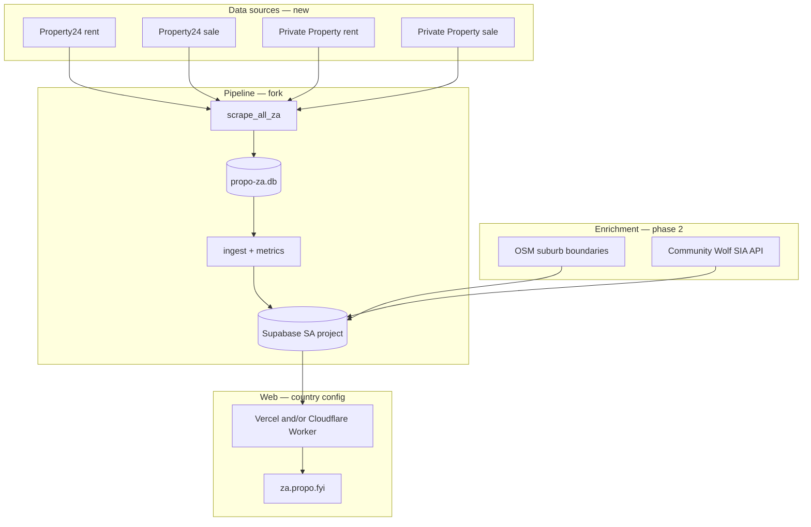
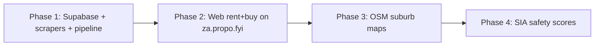

# South Africa market expansion plan

**Date:** 2026-07-08  
**Status:** Planning — not started  
**Goal:** Launch a South Africa property data index (rent + buy only) powered by [Property24](https://www.property24.com/) and [Private Property](https://www.privateproperty.co.za/) scrapers, with suburb maps (OSM boundaries) and safety scores ([Community Wolf SIA](https://safetyintelligence.communitywolf.com/)).

---

## Summary

Propo today is a **Zimbabwe-only** property data index — scrape → SQLite history → Supabase → Next.js on `**propo.fyi`**, currently deployed to **both Vercel and Cloudflare Workers** at the same time. Expanding to South Africa is a **second product surface**, not a data-source swap.

**Product pitch (SA):** *Where can you afford in South Africa? Compare suburb rent and sale prices — with maps and safety context.*

**Explicitly in scope:** residential rent and buy medians, explore, compare, suburb profiles, trends, fair value, movers, active listings.

**Explicitly out of scope (v1):**

- Land / stands mode
- Invest lens and rental yield / opportunity score UX
- Commercial, farms, developments, auctions
- Chat / natural-language search (same wedge as ZW — data index, not portal)

**Differentiators vs ZW:**

- OSM suburb boundaries → interactive maps (SA has good OSM coverage)
- Community Wolf SIA safety scores per suburb (live in `za-wc`, `za-gp`, and other SA metros)

---

## Why a separate stack (not one Supabase)


| Concern           | ZW today                                                             | SA risk if shared                                                     |
| ----------------- | -------------------------------------------------------------------- | --------------------------------------------------------------------- |
| `market_id`       | `{city}_{suburb}` — no country prefix (`analytics/listing_utils.py`) | Collisions (e.g. Johannesburg suburbs appear in ZW `EXCLUDED_CITIES`) |
| Web geo filter    | `filterZimbabweCities()` in `web/src/lib/geo.ts`                     | Mixed-country UX and SEO                                              |
| Currency / locale | USD, `en-ZW` (`web/src/lib/format.ts`, `seo.ts`)                     | ZAR, `en-ZA` required                                                 |
| Pipeline cron     | `Africa/Harare`                                                      | `Africa/Johannesburg`                                                 |
| Lens modes        | Rent · Buy · Land · Invest                                           | Rent · Buy only                                                       |


**Decision:** new Supabase project, separate SQLite history DB, separate web deployment(s), separate GitHub Actions environment.

---

## Production hosting (ZW today)

Propo ZW runs on **two hosts in parallel** — not Cloudflare-only:


| Platform               | Role today                                              | SA implication                                                             |
| ---------------------- | ------------------------------------------------------- | -------------------------------------------------------------------------- |
| **Vercel**             | Next.js (`npm run build` / standard App Router)         | Second Vercel project possible; env vars per project                       |
| **Cloudflare Workers** | OpenNext bundle (`npm run build:cf` / `wrangler.jsonc`) | Second worker (`propo-za`) possible; runtime cannot read repo `data/` JSON |


Both need the same Supabase runtime env vars for live data. `web/README.md` documents the Cloudflare path; Vercel is configured via the dashboard (`.vercel/` is gitignored — no `vercel.json` in repo).

**SA recommendation — pick one primary host for v1:**


| Approach                 | Pros                                                  | Cons                                                                       |
| ------------------------ | ----------------------------------------------------- | -------------------------------------------------------------------------- |
| **Vercel only (SA)**     | Simpler ops; familiar Next.js deploy; one env surface | Different from CF if ZW stays dual                                         |
| **Cloudflare only (SA)** | Matches existing CF worker docs; edge latency         | OpenNext build step; wrangler env management                               |
| **Both (mirror ZW)**     | Redundancy / A-B; same as current ZW setup            | Double deploy cost, double env sync, SEO canonical risk if both are public |


For MVP, **one public hostname → one primary host** is enough. If mirroring ZW’s dual setup, make only one URL canonical (redirect or `rel=canonical`) so Google does not index duplicate SA content on two domains/hosts.

---

## Domain & hosting

**Constraint:** `propo.co.za` is **taken** — do not plan around it unless you acquire the name later.


| Option                   | Example                                              | When to use                                   |
| ------------------------ | ---------------------------------------------------- | --------------------------------------------- |
| **Subdomain (MVP)**      | `za.propo.fyi`                                       | Fastest ship; no new registration; same brand |
| **Alternate `.co.za`**   | `getpropo.co.za`, `propoapp.co.za`, `usepropo.co.za` | Local TLD if a variant is available           |
| `**.africa` TLD**        | `propo.africa`                                       | Regional brand; check registry availability   |
| **New brand + `.co.za`** | e.g. affordability-focused name                      | If Propo brand is weak in SA search           |


**Recommendation:**

1. **Phase 1:** ship at `**za.propo.fyi`** — add DNS on the existing `propo.fyi` zone; no `.co.za` needed yet.
2. **Phase 2:** register an **available** SA domain (check [CO.ZA registry](https://registry.net.za/) or registrar for variants) if local trust/SEO matters; 301 from subdomain if you migrate.
3. **Do not** serve SA content on `propo.fyi` root without hostname-based country routing — bad SEO and confusing UX.

---

## Architecture




---

## Current state (ZW baseline to reuse)


| Layer           | Path / pattern                                             | Reuse for SA                                                   |
| --------------- | ---------------------------------------------------------- | -------------------------------------------------------------- |
| Scraper pattern | `scraper/propertybook_rentals.py`, `property_co_common.py` | Copy structure; new parsers                                    |
| Orchestration   | `scraper/scrape_all.py` → `analytics/run_daily.py`         | New `scrape_all_za.py` + workflow                              |
| History DB      | `data/easishop.db`                                         | `data/propo-za.db`                                             |
| Ingest / sync   | `analytics/ingest_supabase.py`, `sync_dashboard.py`        | Same modules, ZA env                                           |
| Metrics         | `analytics/market_metrics.py`, `rankings.py`               | Same; hide yield columns in UI                                 |
| Migrations      | `supabase/migrations/*.sql`                                | Apply to new project (skip land-only if unused)                |
| Web             | `web/` on Vercel + Cloudflare Workers (ZW)                 | Country config; second Vercel project and/or `propo-za` worker |
| CI              | `.github/workflows/daily-pipeline.yml`                     | New `daily-pipeline-za.yml` + `production-za` env              |


---

## Phase 1 — Data pipeline (ship medians + listings)

### 1.1 Supabase (SA project)

- [ ] Create new Supabase project (region: closest to SA users — e.g. `ap-southeast-1` or EU; evaluate latency).
- [ ] Apply migrations `001`–`010` (history, dashboard, segments, market_id, admin, analytics).
- [ ] **Optional defer:** `011`–`013` (land metrics) — not needed for rent/buy-only v1.
- [ ] Add GitHub Environment `production-za` secrets:
  - `SUPABASE_URL`
  - `SUPABASE_SERVICE_ROLE_KEY`
  - `SUPABASE_DB_URL`
  - `TELEGRAM_BOT_TOKEN` / `TELEGRAM_CHAT_ID` (optional; prefix messages `propo-za`)

### 1.2 Scrapers

- [ ] Capture HTML samples → `source codes/property24/`, `source codes/privateproperty/` (rent + sale listing + detail pages).
- [ ] Implement four scraper modules:
  - `scraper/property24_rentals.py`
  - `scraper/property24_sales.py`
  - `scraper/privateproperty_rentals.py`
  - `scraper/privateproperty_sales.py`
- [ ] Add `scraper/scrape_all_za.py` orchestrator.
- [ ] **Technical notes:**
  - Both sites are JS-heavy; may require Playwright (not just `requests` + BeautifulSoup).
  - Respect rate limits; Property24 / Private Property are more likely to block than ZW portals.
  - Review each site's Terms of Service before production scraping.
- [ ] Normalize to existing listing schema: `listing_url`, `title`, `price`, `city`, `suburb`, `property_type`, `listing_type`, `bedrooms`, `image_url`, etc.

### 1.3 SA location normalization

- [ ] New `analytics/geo_overrides_za.py` (or extend `geo_overrides.py` with country param):
  - Province → metro → suburb hierarchy (Property24: Gauteng → Johannesburg → Sandton).
  - Suburb alias table for portal inconsistencies.
- [ ] Consider prefixing `market_id` with country in SA pipeline only: `za_{city}_{suburb}` — avoids future multi-country merge pain (optional but recommended).

### 1.4 Pipeline wiring

- [ ] Point ZA ingest at `data/propo-za.db`.
- [ ] Add `analytics/run_daily_za.py` (or `COUNTRY=za` flag on existing runner).
- [ ] Add `.github/workflows/daily-pipeline-za.yml`:
  - Cron: `17 4 * * *` with `timezone: Africa/Johannesburg`
  - Environment: `production-za`
  - Run: scrape → ingest → Supabase sync

### 1.5 Property type mapping (SA → canonical)


| SA portal terms     | Canonical bucket           |
| ------------------- | -------------------------- |
| Apartment / Flat    | `flat`                     |
| House               | `house`                    |
| Townhouse / Cluster | `townhouse`                |
| Room / Bachelor     | `room` (rent only)         |
| Security estate     | `house` or tag in metadata |


---

## Phase 2 — Web app (rent + buy only)

### 2.1 Country configuration

Introduce a single config surface (env-driven):

```ts
// Concept — web/src/lib/country-config.ts
COUNTRY=za
NEXT_PUBLIC_SITE_URL=https://za.propo.fyi
NEXT_PUBLIC_DEFAULT_CITY=Johannesburg  // or Cape Town
```


| Setting             | ZW                                | SA                                    |
| ------------------- | --------------------------------- | ------------------------------------- |
| Locale              | `en-ZW`                           | `en-ZA`                               |
| Currency            | USD                               | ZAR                                   |
| Default rent budget | 800                               | TBD (research medians)                |
| Default buy budget  | 250,000                           | TBD                                   |
| Explore modes       | rent, buy, land, invest           | **rent, buy**                         |
| Default city        | Harare                            | Johannesburg                          |
| Site tagline        | Where can you afford in Zimbabwe? | Where can you afford in South Africa? |


### 2.2 Files to localize / branch


| Area           | Files                                                                            |
| -------------- | -------------------------------------------------------------------------------- |
| Geo filter     | Replace `filterZimbabweCities` with country-aware filter in `web/src/lib/geo.ts` |
| SEO            | `web/src/lib/seo.ts`, `sitemap.ts`, `robots.ts`                                  |
| Constants      | `web/src/lib/constants.ts` — budgets, property types, `SITE_NAME` copy           |
| Format         | `web/src/lib/format.ts` — ZAR                                                    |
| Lens           | `web/src/lib/mode.ts`, `lens-provider.tsx` — hide land/invest toggles            |
| Home           | `home-page.tsx` — hero, intent toggle (Rent · Buy only)                          |
| Suburb profile | Hide gross yield, opportunity score, land sections                               |
| Rankings       | Hide land/invest tabs; no yield leaderboards                                     |
| Onboarding     | `onboarding-tour.tsx` — SA copy                                                  |
| Design         | `web/DESIGN.md` — SA variant or country section                                  |
| Assets         | SA skyline hero images, OG image                                                 |


### 2.3 Web deployment (Vercel and/or Cloudflare)

Mirror ZW’s dual-host setup **only if intentional** — otherwise pick one host for SA v1.

**Vercel (if used):**

- [ ] New Vercel project (e.g. `propo-za`) connected to same repo, root directory `web`
- [ ] Build command: `npm run build` (standard Next.js — not `build:cf`)
- [ ] Custom domain: `za.propo.fyi`
- [ ] Environment variables (Production + Preview): same Supabase and `NEXT_PUBLIC_SITE_URL` set as below

**Cloudflare Workers (if used):**

- [ ] New worker name in `wrangler.jsonc` (or `wrangler.za.jsonc`): `propo-za`
- [ ] Build: `npm run build:cf`; deploy with `--keep-vars`
- [ ] Custom domain: `za.propo.fyi` (only one host should serve this URL publicly unless the other redirects)

**Runtime env vars (both platforms):**

- `NEXT_PUBLIC_SUPABASE_URL` (SA project)
- `NEXT_PUBLIC_SUPABASE_ANON_KEY`
- `NEXT_PUBLIC_SITE_URL` (e.g. `https://za.propo.fyi`)
- `COUNTRY=za` (proposed)
- `ADMIN_SECRET`, `SUPABASE_SERVICE_ROLE_KEY` (admin routes; server-only)

- [ ] Separate GA property or `country=za` dimension
- [ ] If dual-host: set canonical URL in SEO metadata to avoid duplicate indexing

### 2.4 Verify deployment

```bash
curl https://za.propo.fyi/api/meta
# Expect: supabaseConfigured: true, marketCount > 0
```

---

## Phase 3 — Maps (OSM suburb boundaries)

SA opens a feature ZW lacks: reliable suburb polygons in OpenStreetMap.

### 3.1 Data ingest

- [ ] Extract suburb boundaries for target metros (Gauteng, Western Cape, KZN initially):
  - Overpass API query (`place=suburb`, `admin_level`, or local tagging conventions)
  - Or prebuilt Geofabrik / HOT extracts
- [ ] New Supabase table, e.g. `suburb_boundaries`:
  - `market_id` (FK to `market_metrics`)
  - `geojson` or PostGIS `geometry`
  - `source` (`osm`), `updated_at`
- [ ] Match OSM names to normalized suburb names (fuzzy match + manual overrides)

### 3.2 Web UI

- [ ] MapLibre GL or Leaflet on city and suburb pages
- [ ] Choropleth by median rent/sale or safety score (phase 3b)
- [ ] Store map tiles policy: respect OSM attribution

**Note:** Maps are net-new UI — the ZW app has no map component today.

---

## Phase 4 — Safety scores (Community Wolf SIA)

[SIA](https://safetyintelligence.communitywolf.com/) provides hex-level safety scores with SA coverage (`za-wc`, `za-gp`, etc.).

### 4.1 Integration

- [ ] Join SIA waitlist / obtain API key
- [ ] Server-side proxy only — `SIA_API_KEY` never in browser
- [ ] Nightly batch: suburb centroid → `POST /v3/hex/lookup` (intent: `live` or `walk`)
- [ ] Cache in Supabase, e.g. `suburb_safety`:
  - `market_id`, `safety_score`, `color_index`, `confidence`, `breakdown` (jsonb), `as_of`

### 4.2 Product surface

- [ ] Safety badge on suburb profile header
- [ ] Optional map overlay (colorIndex choropleth)
- [ ] Methodology footnote + **Powered by SIA** attribution (required on Free tier)

### 4.3 Cost planning

- 1 hex lookup = 1 API unit
- Batch ~500 suburbs nightly ≈ 500 units/day ≈ 15k/month → Starter tier ($49) sufficient for early production
- Cache aggressively; do not call SIA on every page view

---

## Legal & compliance


| Topic               | Action                                                                                       |
| ------------------- | -------------------------------------------------------------------------------------------- |
| **Scraping**        | Review Property24 and Private Property ToS; plan for blocks and takedown requests            |
| **POPIA**           | SA privacy law — update privacy policy for SA site; lawful basis for processing listing data |
| **SIA attribution** | Free tier requires "Powered by SIA"; paid tiers remove it                                    |
| **OSM**             | Display © OpenStreetMap contributors on maps                                                 |
| **Listing data**    | Position as aggregated market intelligence from public listings (same as ZW)                 |


---

## Infrastructure checklist


| Item               | ZW (existing)          | SA (new)                                                                |
| ------------------ | ---------------------- | ----------------------------------------------------------------------- |
| Supabase project   | ✓                      | **New**                                                                 |
| SQLite history DB  | `easishop.db`          | `propo-za.db`                                                           |
| GitHub environment | `production`           | `production-za`                                                         |
| Daily workflow     | `daily-pipeline.yml`   | `daily-pipeline-za.yml`                                                 |
| Vercel project     | ZW (live)              | **New** `propo-za` (optional)                                           |
| Cloudflare Worker  | `propo`                | `propo-za` (optional)                                                   |
| Public URL         | `propo.fyi`            | `za.propo.fyi` → available `.co.za` variant later (`propo.co.za` taken) |
| Telegram alerts    | `propo daily pipeline` | `propo-za daily pipeline`                                               |
| Admin dashboard    | `/admin`               | Same route, SA Supabase backend                                         |


---

## Phasing summary




| Phase | Deliverable                                      | Success metric                               |
| ----- | ------------------------------------------------ | -------------------------------------------- |
| **1** | SA listings ingested; suburb medians in Supabase | `/api/meta` marketCount > 100                |
| **2** | Public site live at `za.propo.fyi`               | Explore + suburb profiles work for JHB + CPT |
| **3** | Suburb boundary maps on city/suburb pages        | Map renders with correct suburb polygon      |
| **4** | Safety score on suburb profiles                  | Cached SIA score + attribution visible       |


---

## Open questions

1. **Default city:** Johannesburg (largest market) vs Cape Town (brand/photography)?
2. **market_id prefix:** adopt `za`_ now or keep `{city}_{suburb}` in isolated DB?
3. **Scraper runtime:** GitHub Actions sufficient or SA sites require residential IP / VM?
4. **Brand:** stay Propo or SA-specific sub-brand?
5. **SA hosting:** Vercel only, Cloudflare only, or dual-host like ZW?
6. **SA domain:** stick with `za.propo.fyi` or register alternate `.co.za` / `.africa`?
7. **Multi-tenant refactor:** when (if ever) merge ZW + SA into one deploy with hostname routing?
8. **ZW dual-host:** which is canonical for `propo.fyi` today — Vercel or Cloudflare? (SA should follow same pattern)

---

## Related docs


| Doc                                                                                      | Relevance                                                             |
| ---------------------------------------------------------------------------------------- | --------------------------------------------------------------------- |
| [2026-06-27-market-intelligence-roadmap.md](./2026-06-27-market-intelligence-roadmap.md) | Feature set to port (trends, fair value, movers, reports)             |
| [2026-07-03-land-mode-plan.md](./2026-07-03-land-mode-plan.md)                           | Land mode — **do not port** to SA v1                                  |
| [2026-07-05-user-lens-plan.md](./2026-07-05-user-lens-plan.md)                           | Invest lens — **do not port** to SA v1                                |
| [2026-06-25-github-actions-automation.md](./2026-06-25-github-actions-automation.md)     | Pipeline CI pattern                                                   |
| `web/README.md`                                                                          | Cloudflare Workers deploy (Vercel also in use for ZW — see dashboard) |
| `web/DESIGN.md`                                                                          | Design system to adapt for SA                                         |


---

## Workspace (expected new paths)


| Area                 | Path                                                                                  |
| -------------------- | ------------------------------------------------------------------------------------- |
| Scrapers             | `scraper/property24_*.py`, `scraper/privateproperty_*.py`, `scraper/scrape_all_za.py` |
| Source captures      | `source codes/property24/`, `source codes/privateproperty/`                           |
| Geo (SA)             | `analytics/geo_overrides_za.py`                                                       |
| Pipeline             | `analytics/run_daily_za.py`, `.github/workflows/daily-pipeline-za.yml`                |
| Country config       | `web/src/lib/country-config.ts` (proposed)                                            |
| Boundaries           | `analytics/ingest_osm_boundaries.py` (proposed)                                       |
| Safety cache         | `analytics/sync_sia_scores.py` (proposed)                                             |
| Migrations (SA-only) | `supabase/migrations/014_suburb_boundaries.sql`, `015_suburb_safety.sql` (proposed)   |


